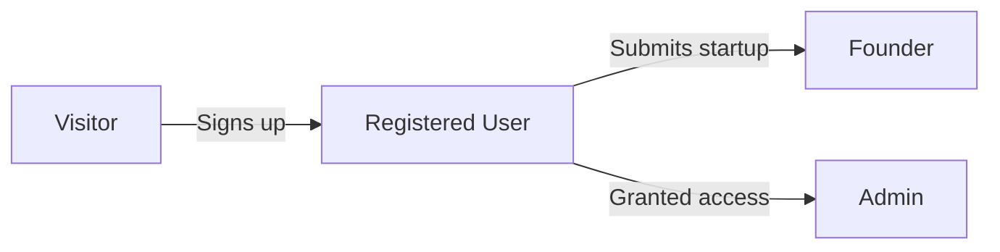
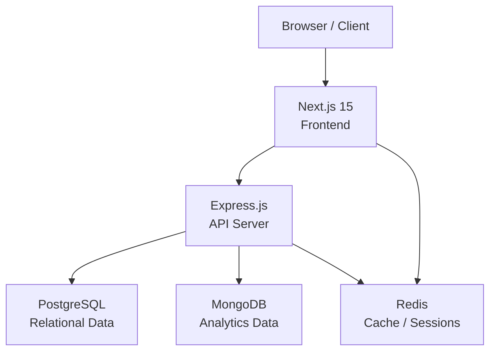

# What We're Building: LaunchPad

Every great software project starts with a clear picture of the destination. Before we write a single line of code, we need to understand what we're building, who it's for, and why it matters. In this lesson, we'll walk through LaunchPad — the full-stack application you'll build across all 13 courses in this masterclass. By the end, you'll have a thorough understanding of every feature, every screen, and how the entire tech stack fits together.

## What You'll Learn

- What LaunchPad is and the problem it solves
- The complete feature set across all user types
- A screen-by-screen walkthrough of the application
- The tech stack and why each technology was chosen
- How the 13 courses map to building the complete app

## Concepts

### The Problem We're Solving

Discovering new startups is harder than it should be. Founders build incredible products but struggle to get them in front of the right audience. Potential users and investors spend hours searching across scattered platforms, Twitter threads, and word-of-mouth recommendations. There's no single, curated place to discover, evaluate, and engage with new startups.

LaunchPad solves this by creating a startup directory platform — think of it as a combination of Product Hunt and TrustMRR. It's a place where founders can showcase their startups, users can discover and upvote the best ones, and the community can discuss and provide feedback.

### Why This Project?

LaunchPad is the perfect full-stack project because it touches every skill a modern developer needs:

- Authentication and authorization (multiple user roles)
- CRUD operations with complex relationships
- Real-time features (upvoting, comments)
- Search and filtering with multiple criteria
- File uploads (logos, screenshots)
- Email notifications
- API design (REST and data modeling)
- Caching and performance optimization
- Deployment and DevOps

It's complex enough to be a real-world application, but scoped enough that you can build it in a structured learning path.

### Who Uses LaunchPad?

LaunchPad serves four distinct user types, each with different needs:

1. Visitors — People who browse startups without creating an account. They can view listings, search, and filter, but cannot interact beyond reading.

2. Registered Users — People who have created an account. They can upvote startups, leave comments, save favorites, and customize their browsing experience.

3. Founders — Registered users who submit their own startups. They get a founder dashboard to manage their listings, view analytics, and respond to comments.

4. Admins — Platform administrators who moderate content, manage categories, review submissions, and handle reported content.



## Step by Step

### Step 1: Understanding the Core Features

Let's walk through every major feature of LaunchPad, organized by area.

Startup Discovery is the heart of the platform. The homepage displays a curated feed of startups, sorted by popularity (upvotes) or recency. Users can browse by category — think "AI Tools," "Developer Tools," "SaaS," "Fintech," "Health Tech," and more. Each startup card shows the name, tagline, logo, category, upvote count, and comment count. Clicking a card takes you to the full startup detail page.

Search and Filtering allows users to find exactly what they're looking for. There's a global search bar that searches across startup names, taglines, and descriptions. Advanced filters let you narrow by category, launch date, upvote count range, and tags. Results can be sorted by newest, most upvoted, most discussed, or trending (a calculated score based on recent activity).

The Upvote System is how the community curates quality. Registered users can upvote a startup once. Upvotes are displayed prominently on each startup card and detail page. The homepage "Top Startups" section showcases the most upvoted startups of the day, week, and month. Upvoting is instant and optimistic — the UI updates immediately before the server confirms.

Comments and Discussion live on each startup's detail page. Registered users can leave comments, and comments support threading (replies to replies). Founders can pin important comments and respond with a special "Founder Response" badge. Comments can be upvoted too, surfacing the most helpful ones.

Startup Submission is the founder's workflow. A multi-step form guides founders through submitting their startup: basic info (name, tagline, URL), detailed description with rich text, logo and screenshot uploads, category and tag selection, and team member information. Submissions go into a review queue before appearing publicly.

User Profiles show a user's activity on the platform. Each profile displays upvoted startups, comments, submitted startups (for founders), and join date. Founders get an enhanced profile with all their startups listed.

The Admin Dashboard provides moderation tools. Admins can approve or reject startup submissions, manage categories and tags, handle reported comments, view platform analytics (total users, startups, upvotes), and feature startups on the homepage.

### Step 2: Screen-by-Screen Walkthrough

Let's walk through each screen of the application as a user would experience it.

The Homepage is the first thing visitors see. At the top is a navigation bar with the LaunchPad logo, a search bar, category links, and login/signup buttons (or user avatar if logged in). Below that is a hero section with a tagline like "Discover the Next Big Thing" and a call-to-action to browse or submit. The main content area shows startup cards in a grid layout, with tabs for "Today," "This Week," "This Month," and "All Time." Each card is a compact rectangle showing the startup logo on the left, the name and tagline in the middle, and the upvote button with count on the right. A sidebar (or secondary section on mobile) shows trending categories and featured startups.

```
+------------------------------------------------------------------+
|  Logo    [Search Bar....................]   Categories   [Login]  |
+------------------------------------------------------------------+
|                                                                    |
|         Discover the Next Big Thing                                |
|         [Browse Startups]  [Submit Yours]                          |
|                                                                    |
+------------------------------------------------------------------+
|  [Today]  [This Week]  [This Month]  [All Time]                   |
+------------------------------------------------------------------+
|                                                |                   |
|  +------------------------------------------+  |  Trending         |
|  | [Logo]  Startup Name         [Upvote 42] |  |  Categories       |
|  |         Short tagline here               |  |  - AI Tools       |
|  |         #ai  #saas          12 comments  |  |  - SaaS           |
|  +------------------------------------------+  |  - DevTools       |
|                                                |  - Fintech        |
|  +------------------------------------------+  |                   |
|  | [Logo]  Another Startup      [Upvote 28] |  |  Featured         |
|  |         Another tagline                  |  |  [Startup Card]   |
|  |         #devtools           8 comments   |  |                   |
|  +------------------------------------------+  |                   |
|                                                |                   |
+------------------------------------------------------------------+
```

The Startup Detail Page is where users learn everything about a startup. The top section shows the startup logo (large), name, tagline, and external link button. Below that are key stats: upvote count, comment count, and launch date. The description section uses rich text to tell the startup's story — what it does, who it's for, and why it matters. A screenshot gallery lets users see the product in action. Below the description is the team section showing founder info. The bottom half of the page is the comments section with a text input, existing comments in a threaded layout, and sorting options.

```
+------------------------------------------------------------------+
|  [Logo Large]                                                      |
|  Startup Name                                                      |
|  A concise tagline describing the product                          |
|  [Visit Website]   [Upvote 42]   [Save]                           |
+------------------------------------------------------------------+
|  Launched: Jan 15, 2026  |  42 upvotes  |  12 comments            |
+------------------------------------------------------------------+
|                                                                    |
|  About This Startup                                                |
|  Full description paragraph here. Multiple paragraphs of          |
|  rich text content explaining the product, the problem it          |
|  solves, and who should use it...                                  |
|                                                                    |
+------------------------------------------------------------------+
|  Screenshots                                                       |
|  [Screenshot 1]  [Screenshot 2]  [Screenshot 3]                   |
+------------------------------------------------------------------+
|  Team                                                              |
|  [Avatar] Founder Name - CEO                                      |
+------------------------------------------------------------------+
|  Comments (12)                                                     |
|  [Write a comment...                              ] [Post]         |
|                                                                    |
|  [Avatar] User Name - 2 hours ago                                 |
|  This looks amazing, great work on the design!                     |
|     [Reply]  [Upvote 3]                                           |
|                                                                    |
|     [Avatar] Founder Name (Founder) - 1 hour ago                  |
|     Thanks so much! We worked hard on it.                          |
|        [Reply]  [Upvote 1]                                        |
+------------------------------------------------------------------+
```

The Category Page shows all startups in a specific category. It has the category name and description at the top, followed by the same card grid as the homepage but filtered to that category. Filter controls let users further narrow within the category.

The Search Results Page appears when a user searches. It shows the search query at the top, result count, filter sidebar, and matching startups in the card grid. An empty state appears if no results match, with suggestions for broader searches.

The Submit Startup Page is a multi-step form. Step 1 covers basics: startup name, tagline (120 chars max), and website URL. Step 2 is the description: a rich text editor for the full story. Step 3 handles media: logo upload (square, min 200x200) and up to 5 screenshot uploads. Step 4 is categorization: pick a primary category, add up to 5 tags. Step 5 is the review screen: preview everything before submitting. A progress indicator at the top shows which step you're on.

```
+------------------------------------------------------------------+
|  Submit Your Startup                                               |
|                                                                    |
|  [1 Basics] --- [2 Description] --- [3 Media] --- [4 Tags] ---   |
|  [5 Review]                                                        |
|       ^                                                            |
|   (current)                                                        |
+------------------------------------------------------------------+
|                                                                    |
|  Startup Name                                                      |
|  [__________________________________]                              |
|                                                                    |
|  Tagline (120 characters max)                                      |
|  [__________________________________]                              |
|  87 characters remaining                                           |
|                                                                    |
|  Website URL                                                       |
|  [https://________________________________]                        |
|                                                                    |
|                                    [Next Step -->]                  |
+------------------------------------------------------------------+
```

The User Profile Page shows the user's avatar, display name, bio, and join date. Below that are tabs: "Upvoted" shows startups they've upvoted, "Comments" shows their comment history, and "Submitted" (founders only) shows their startup listings. Each tab displays the relevant content in a list format.

The Founder Dashboard is accessible to users who have submitted startups. It shows an overview with total upvotes across all startups, total comments, and view counts. Below that is a list of their startups with status indicators (pending review, approved, rejected). Clicking a startup shows detailed analytics: upvote history chart, comment activity, and referral sources.

The Admin Dashboard has a left sidebar with navigation: Overview, Submissions Queue, Categories, Reports, and Users. The Overview shows key metrics as stat cards and a recent activity feed. The Submissions Queue lists pending startups with approve/reject buttons and preview links. The Categories section lets admins create, edit, reorder, and delete categories. The Reports section shows flagged comments and startups with moderation actions.

The Authentication Pages include a Login page with email/password form, a Signup page with name, email, password, and password confirmation, and a Forgot Password page with email input and reset flow.

### Step 3: Understanding the Tech Stack

LaunchPad is built with a modern, production-ready tech stack. Here's every technology and why it was chosen.

Next.js 15 serves as the frontend framework. It provides server-side rendering for SEO (startup pages need to be indexable), the App Router for clean file-based routing, Server Components for performance, and built-in API routes we'll use during prototyping. We chose Next.js because it's the most popular React framework for production applications, and its hybrid rendering model (static, server, and client) is perfect for a content-heavy platform like LaunchPad.

Express.js powers the backend API. While Next.js has API routes, we build a separate Express server for several reasons: clear separation of concerns between frontend and backend, the ability to scale them independently, middleware ecosystem for authentication, rate limiting, and logging, and real-world architecture patterns that match how companies actually build software. Express handles all the business logic, data validation, and database communication.

PostgreSQL is the primary database. Startups, users, categories, upvotes, and comments are all relational data with clear relationships. PostgreSQL gives us ACID transactions (critical for upvote counts), powerful querying with joins across tables, full-text search capabilities, and JSON column support for flexible metadata. We use PostgreSQL for all structured, relational data.

MongoDB handles unstructured and semi-structured data. Startup analytics (page views, click events), activity logs, and notification data work better as documents. MongoDB provides flexible schemas for varying analytics data, high write throughput for tracking events, and easy aggregation for dashboard metrics. This dual-database approach teaches you when to use SQL vs NoSQL.

Redis serves multiple purposes. It caches frequently accessed data like the homepage startup list and category counts. It manages sessions for authenticated users. It handles rate limiting to prevent API abuse. And it powers real-time features through pub/sub for live upvote counts. Redis is the glue that makes a database-backed application feel fast.

Docker containerizes the entire stack. Every service — Next.js, Express, PostgreSQL, MongoDB, Redis — runs in its own container. Docker Compose orchestrates them locally so you can start everything with a single command. This ensures consistent environments across development machines and mirrors production deployment.



The browser communicates with the Next.js frontend. Next.js handles rendering pages and makes API calls to the Express backend. Express processes business logic and communicates with PostgreSQL for relational data, MongoDB for analytics, and Redis for caching. Next.js also reads from Redis directly for cached data in Server Components.

This architecture separates concerns cleanly. The frontend focuses on presentation and user experience. The API focuses on business rules and data access. Each database handles the data type it's best suited for. And Redis sits in the middle making everything fast.

### Step 4: Mapping Features to the 13 Courses

Here's how the 13 courses in this masterclass build LaunchPad piece by piece:

Course 01 (Think in Systems) is where we are now — planning, user stories, data modeling, and architecture. No code yet, just thinking through the entire system.

Course 02 (Database Design) takes the data model from this course and implements it in PostgreSQL. You'll write migrations, set up schemas, seed data, and learn SQL querying patterns.

Course 03 (API Foundations) builds the Express API layer. You'll create RESTful endpoints for startups, categories, and users with proper error handling and validation.

Course 04 (Authentication) adds user signup, login, sessions, password reset, and role-based access control for visitors, users, founders, and admins.

Course 05 (Frontend Foundation) builds the Next.js application shell — layout, navigation, routing, and the component library.

Course 06 (Data Fetching) connects the frontend to the API. You'll implement server-side data fetching, client-side state management, and loading/error states.

Course 07 (Forms and Mutations) builds the interactive features — the startup submission form, comments, upvoting, and profile editing.

Course 08 (Search and Filtering) adds search functionality, category filtering, sorting, and pagination with both frontend and backend implementation.

Course 09 (File Uploads) implements logo and screenshot uploads with image processing, storage, and optimization.

Course 10 (Real-time Features) adds live upvote counts, notification badges, and activity feeds using WebSockets and Redis pub/sub.

Course 11 (Testing) writes unit tests, integration tests, and end-to-end tests for both the API and the frontend.

Course 12 (Performance) optimizes the application with caching strategies, database query optimization, lazy loading, and bundle size reduction.

Course 13 (Deployment) containerizes everything with Docker, sets up CI/CD pipelines, and deploys to a cloud provider.

Each course builds on the previous one. By the end, you'll have a complete, production-quality application — and the skills to build your own.

```mermaid
graph LR
    C01[Course 01<br/>Think in Systems] --> C02[Course 02<br/>Database]
    C02 --> C03[Course 03<br/>API]
    C03 --> C04[Course 04<br/>Auth]
    C04 --> C05[Course 05<br/>Frontend]
    C05 --> C06[Course 06<br/>Data Fetching]
    C06 --> C07[Course 07<br/>Forms]
    C07 --> C08[Course 08<br/>Search]
    C08 --> C09[Course 09<br/>Uploads]
    C09 --> C10[Course 10<br/>Real-time]
    C10 --> C11[Course 11<br/>Testing]
    C11 --> C12[Course 12<br/>Performance]
    C12 --> C13[Course 13<br/>Deployment]
```



### Step 5: The Development Philosophy

Before we dive into planning details in the next lessons, let's establish the philosophy that will guide our development throughout this masterclass.

Think before you code. Every lesson in this course (Course 01) exists because planning saves time. A data model sketched on paper in 30 minutes prevents a week of database migrations later. User stories written upfront prevent building features nobody asked for. This is not bureaucracy — it's efficiency.

Build incrementally. We don't build the entire application and then test it. We build one feature at a time, verify it works, and then build the next. Each course delivers a working (if incomplete) version of LaunchPad. After Course 03, you have a working API. After Course 05, you have a working frontend. After Course 07, users can actually submit and upvote startups.

Embrace constraints. The MVP doesn't include every feature on our wish list. That's intentional. Constraints force you to focus on what matters most. A startup directory that lets you browse, search, upvote, and submit startups is useful. A startup directory that also has email notifications, analytics dashboards, and social sharing is better — but only if the core works first.

Learn by doing. This isn't a lecture series. Every lesson includes exercises. Every course builds real, functional code. The fastest path to understanding is building something with your own hands, running into problems, and solving them.

## Try It Yourself

Now it's your turn. Before we move into user stories and planning in the next lesson, spend some time thinking about LaunchPad as a product.

Exercise: Create Your Feature List

Open a document or grab a piece of paper. Write down your answers to these questions:

1. List 5 features you think are absolutely essential for LaunchPad to work at all. These are the features without which the app would be pointless. For example, "View a list of startups" is essential — without it, there's no directory.

2. List 5 features that would be nice to have but aren't strictly necessary for launch. Think about features that enhance the experience but aren't core functionality. For example, "Dark mode toggle" improves the experience but isn't required.

3. Think of 3 features we haven't mentioned that you'd want in a startup directory. Get creative. Maybe it's a "Compare startups" feature, or a "Startup of the Week" newsletter, or integration with LinkedIn for founder verification.

4. For each of the 3 new features you came up with, write one sentence describing what it does and one sentence explaining why a user would want it.

5. Sketch (on paper or in a drawing tool) the homepage layout. Don't worry about making it pretty — just boxes and labels showing where the navigation, search, startup cards, sidebar, and footer would go. Pay attention to information hierarchy: what should the user see first?

This exercise builds the muscle of thinking about software from the user's perspective before jumping into code. The features you identified and the wireframe you sketched are the same artifacts that product teams create at real companies before engineering begins.

## Key Takeaways

- LaunchPad is a startup directory platform that serves four user types: visitors, registered users, founders, and admins
- The application includes discovery, search, upvoting, comments, submission workflows, user profiles, and admin moderation
- The tech stack combines Next.js 15, Express, PostgreSQL, MongoDB, Redis, and Docker for a production-grade architecture
- Each technology was chosen for a specific purpose — PostgreSQL for relational data, MongoDB for analytics, Redis for caching and sessions
- The 13 courses in this masterclass each build a specific layer of the application, from database to deployment
- Thinking about features and screens before writing code is how professional teams build software

## Next Steps

Now that you understand what we're building, it's time to define the work precisely. In the next lesson, we'll write user stories for LaunchPad — the standard format that development teams use to describe features from the user's perspective. You'll learn the "As a [user], I want to [action], so that [benefit]" format, write acceptance criteria, and prioritize which features to build first.
