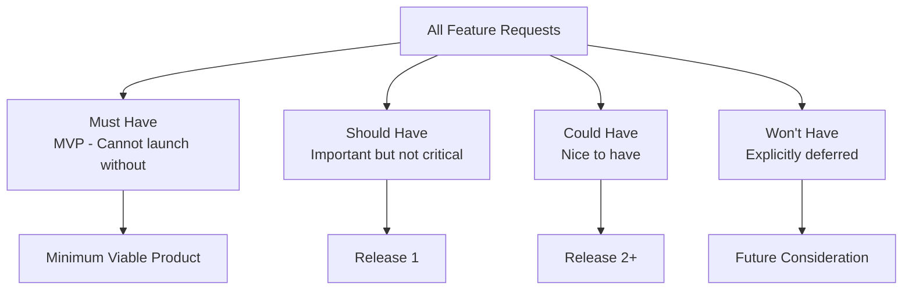

# User Stories: Defining What Users Need

Software development fails most often not because of bad code, but because teams build the wrong thing. User stories are the tool that prevents this. They force you to think about features from the perspective of the people who will actually use your software — not from the perspective of the database schema or the API endpoint. In this lesson, you'll learn how to write user stories, define acceptance criteria, and prioritize work using the MoSCoW method. We'll write a comprehensive set of user stories for LaunchPad that will guide the rest of this masterclass.

## What You'll Learn

- The user story format and why it works
- How to write effective acceptance criteria using Given/When/Then
- The four user types in LaunchPad and their specific needs
- MoSCoW prioritization and how to apply it
- A complete set of 20 user stories for LaunchPad

## Concepts

### Why User Stories Matter

Traditional software specifications read like legal documents: "The system shall display a list of startups sorted by date." They describe what the system does, not why anyone cares. User stories flip this around. They start with a person, describe what that person wants to accomplish, and explain the value they get from it.

This matters because it keeps the team focused on outcomes, not outputs. A feature is only valuable if someone benefits from it. By writing every requirement as a user story, you create a constant reminder that software exists to serve people.

User stories also enable conversation. They're intentionally brief — not because the details don't matter, but because the details should emerge from discussion between developers, designers, and stakeholders. A user story is a promise to have a conversation, not a complete specification.

### The User Story Format

Every user story follows this template:

As a [type of user], I want to [perform an action], so that [I get a benefit].

The three parts serve distinct purposes:

"As a [type of user]" identifies who wants this feature. Different users have different needs. A visitor browsing startups has different goals than an admin moderating content. Naming the user type keeps the team focused on who they're serving.

"I want to [perform an action]" describes the specific thing the user wants to do. This should be concrete and observable. "I want to search for startups" is good. "I want a better experience" is too vague.

"So that [I get a benefit]" explains why this action matters. This is the most important part and the one teams most often skip. The benefit tells you whether the feature is worth building and helps you evaluate alternative solutions. If you can't articulate the benefit, maybe the feature isn't needed.

Here's an example that shows the difference between a weak story and a strong one:

Weak: As a user, I want to click buttons, so that things happen.

Strong: As a registered user, I want to upvote a startup I find promising, so that I can help surface quality products for the community.

The strong version identifies the specific user type, names a concrete action, and explains the real-world value.

### Acceptance Criteria and Given/When/Then

A user story describes what to build. Acceptance criteria describe how to verify it's built correctly. They define the boundaries of "done."

The Given/When/Then format (from Behavior-Driven Development) provides a structured way to write acceptance criteria:

Given [a precondition or context], When [an action is performed], Then [an expected outcome occurs].

For example, for a login user story:

Given I am on the login page and I have a valid account, When I enter my email and password and click "Log In," Then I am redirected to the homepage and I see my avatar in the navigation bar.

Good acceptance criteria are testable. Anyone on the team should be able to read them and determine whether the feature works correctly. They also define edge cases: what happens when the password is wrong? What happens when the email doesn't exist?

Each user story typically has 3-5 acceptance criteria. Fewer than 3 usually means you haven't thought through edge cases. More than 7 usually means the story is too large and should be split.

### The INVEST Criteria

Good user stories follow the INVEST criteria:

Independent — Each story can be developed and delivered on its own, without depending on other stories being done first. This allows flexible prioritization.

Negotiable — Stories aren't contracts. The details can be discussed and adjusted as the team learns more during development.

Valuable — Every story delivers value to a user or the business. If a story doesn't have a clear benefit, question whether it's needed.

Estimable — The team can roughly estimate how much work the story requires. If a story is too vague to estimate, it needs to be broken down further.

Small — Stories should be completable within a single sprint (typically 1-2 weeks). Large stories should be split into smaller ones.

Testable — You can define clear acceptance criteria that verify the story is done.

### MoSCoW Prioritization

Not all features are created equal. MoSCoW is a prioritization framework that sorts requirements into four categories:

Must Have — Features the application cannot function without. If any Must Have feature is missing, the product should not launch. These define the minimum viable product. Example: "Users must be able to view startups." Without this, there's no product.

Should Have — Important features that are not critical for launch but should be included if possible. The product works without them, but the experience is noticeably worse. Example: "Users should be able to filter startups by category." The app works without it, but discovery is much harder.

Could Have — Desirable features that are included only if time and resources allow. They enhance the experience but their absence doesn't significantly impact the product. Example: "Users could receive email notifications about new startups in their favorite categories." Nice, but not essential.

Won't Have (this time) — Features explicitly excluded from the current scope. This is just as important as the other categories because it prevents scope creep and sets expectations. Example: "The app won't have a mobile app for this release." This isn't a rejection — it's a deferral.

The power of MoSCoW is the conversation it forces. Stakeholders naturally want everything to be "Must Have." The framework requires honest discussion about what's truly essential versus what's merely desired.

## Step by Step

### Step 1: Visitor User Stories

Visitors are unauthenticated users browsing the platform. They can see content but cannot interact beyond viewing.

Story V1: Browse the startup feed

As a visitor, I want to see a list of startups on the homepage, so that I can discover new and interesting products.

Acceptance Criteria:
- Given I navigate to the homepage, When the page loads, Then I see a list of startup cards showing name, tagline, logo, category, and upvote count
- Given the homepage has loaded, When I scroll to the bottom of the visible startups, Then more startups load automatically or I see a "Load More" button
- Given there are startups from today, When I view the homepage, Then today's startups appear first by default
- Given the page is loading, When I wait for data, Then I see skeleton placeholder cards instead of a blank page

Priority: Must Have — This is the core functionality of the platform.

Story V2: View startup details

As a visitor, I want to click on a startup to see its full details, so that I can learn more about products that interest me.

Acceptance Criteria:
- Given I am on the homepage, When I click a startup card, Then I am taken to that startup's detail page
- Given I am on a startup detail page, When the page loads, Then I see the startup's logo, name, tagline, full description, screenshots, team info, launch date, upvote count, and comments
- Given I am on a startup detail page, When I try to upvote or comment, Then I see a prompt to log in or create an account
- Given I share the URL of a startup page, When someone opens that URL, Then they see the same startup detail page (deep linking works)

Priority: Must Have — Users need to see details before they can evaluate a startup.

Story V3: Search for startups

As a visitor, I want to search for startups by name or keyword, so that I can find specific products I've heard about.

Acceptance Criteria:
- Given I am on any page, When I type in the search bar and press Enter, Then I see a results page with startups matching my search query
- Given I have searched for a term, When no startups match, Then I see a message saying "No results found" with suggestions to broaden my search
- Given I have searched for a term, When results appear, Then the matching text is highlighted in the startup name or tagline
- Given I am typing in the search bar, When I pause typing, Then I see search suggestions based on startup names

Priority: Must Have — Discovery without search is frustrating for users who know what they're looking for.

Story V4: Filter startups by category

As a visitor, I want to filter startups by category, so that I can browse products in areas that interest me.

Acceptance Criteria:
- Given I am on the homepage, When I click a category name in the navigation or sidebar, Then I see only startups in that category
- Given I am viewing a category, When startups are displayed, Then I see the category name and description at the top of the page
- Given I am viewing a category, When I click "All Categories," Then I return to the unfiltered homepage
- Given a category has no startups, When I navigate to that category, Then I see a friendly empty state message

Priority: Should Have — The app works without it, but browsing is harder.

Story V5: View the about page

As a visitor, I want to read about what LaunchPad is and how it works, so that I can decide whether to create an account.

Acceptance Criteria:
- Given I am on any page, When I click the "About" link in the footer, Then I see a page explaining LaunchPad's mission and how it works
- Given I am on the about page, When I read the content, Then I see clear calls-to-action to sign up or browse startups
- Given I am on the about page, When the page loads, Then I see information about how to submit a startup as a founder

Priority: Could Have — Helpful for conversion but not essential.

### Step 2: Registered User Stories

Registered users have created an account and can interact with the platform.

Story U1: Create an account

As a visitor, I want to sign up for LaunchPad, so that I can upvote startups and participate in discussions.

Acceptance Criteria:
- Given I am on the signup page, When I enter my name, email, and password and click "Sign Up," Then my account is created and I am logged in
- Given I am on the signup page, When I enter an email that already exists, Then I see an error message saying "An account with this email already exists"
- Given I am creating a password, When my password is shorter than 8 characters, Then I see a validation error before submitting the form
- Given I have signed up, When my account is created, Then I receive a welcome email
- Given I am on the login page, When I click "Sign Up" link, Then I am taken to the signup page

Priority: Must Have — No interaction is possible without accounts.

Story U2: Log in to my account

As a registered user, I want to log in with my email and password, so that I can access my account and interact with the platform.

Acceptance Criteria:
- Given I am on the login page, When I enter valid credentials and click "Log In," Then I am redirected to the homepage and I see my avatar in the navigation
- Given I am on the login page, When I enter incorrect credentials, Then I see a generic error message "Invalid email or password" (not revealing which field is wrong for security)
- Given I am logged in, When I close the browser and return within 7 days, Then I am still logged in (persistent session)
- Given I am on any page while not logged in, When I click "Log In," Then I am taken to the login page with a redirect back to the page I was on

Priority: Must Have — Users must be able to access their accounts.

Story U3: Upvote a startup

As a registered user, I want to upvote a startup, so that I can show support for products I like and help others discover them.

Acceptance Criteria:
- Given I am logged in and viewing a startup, When I click the upvote button, Then the upvote count increases by 1 and the button changes to an "upvoted" state
- Given I have already upvoted a startup, When I click the upvote button again, Then my upvote is removed and the count decreases by 1 (toggle behavior)
- Given I am not logged in, When I click the upvote button, Then I see a prompt to log in
- Given I upvote a startup, When the page refreshes, Then my upvote is still recorded and the button shows the upvoted state

Priority: Must Have — Upvoting is the core engagement mechanic.

Story U4: Comment on a startup

As a registered user, I want to leave a comment on a startup page, so that I can share my feedback or ask the founder questions.

Acceptance Criteria:
- Given I am logged in and on a startup detail page, When I type a comment and click "Post," Then my comment appears at the top of the comments section
- Given I am viewing comments, When I click "Reply" on a comment, Then a reply input appears below that comment for threaded replies
- Given I have posted a comment, When I view it, Then I see my name, avatar, the comment text, and a timestamp showing how long ago it was posted
- Given I am the author of a comment, When I click "Delete" on my comment, Then the comment is removed after a confirmation prompt
- Given I try to post an empty comment, When I click "Post," Then nothing happens and the input shows a validation message

Priority: Should Have — Engagement is important but the platform functions without comments.

Story U5: Save startups to favorites

As a registered user, I want to save startups to a favorites list, so that I can easily find them later.

Acceptance Criteria:
- Given I am logged in and viewing a startup, When I click the "Save" or bookmark icon, Then the startup is added to my favorites and the icon fills in
- Given I have saved startups, When I navigate to my profile's "Saved" tab, Then I see all my saved startups in a list
- Given I have saved a startup, When I click the bookmark icon again, Then the startup is removed from my favorites
- Given I have no saved startups, When I view my "Saved" tab, Then I see a helpful empty state encouraging me to browse startups

Priority: Should Have — Enhances the user experience significantly.

Story U6: Edit my profile

As a registered user, I want to update my profile information, so that other users can learn about me.

Acceptance Criteria:
- Given I am logged in, When I navigate to my profile settings, Then I see a form with my current name, bio, and avatar
- Given I am editing my profile, When I change my display name and click "Save," Then my name is updated across the platform
- Given I am editing my profile, When I upload a new avatar image, Then my old avatar is replaced everywhere it appears
- Given I clear my bio field and save, When others view my profile, Then the bio section is hidden rather than showing empty space

Priority: Could Have — Functional accounts work without custom profiles.

### Step 3: Founder User Stories

Founders are registered users who submit and manage startups on the platform.

Story F1: Submit a new startup

As a founder, I want to submit my startup to LaunchPad, so that it can be discovered by potential users and investors.

Acceptance Criteria:
- Given I am logged in, When I click "Submit Startup" in the navigation, Then I see a multi-step submission form
- Given I am on step 1 of the form, When I enter the startup name, tagline, and URL and click "Next," Then I proceed to step 2
- Given I have completed all steps, When I click "Submit for Review," Then I see a confirmation message and my startup enters the review queue with a "pending" status
- Given I skip a required field, When I try to proceed to the next step, Then I see a validation error indicating which field is required
- Given I close the browser mid-submission, When I return to the form, Then my progress is restored from a saved draft

Priority: Must Have — Without submissions, there's no content.

Story F2: Upload startup media

As a founder, I want to upload a logo and screenshots for my startup, so that users can see what my product looks like.

Acceptance Criteria:
- Given I am on step 3 of the submission form, When I upload a logo image, Then I see a preview of the uploaded image
- Given I am uploading a logo, When the image is smaller than 200x200 pixels, Then I see an error asking for a larger image
- Given I am on step 3, When I upload screenshots, Then I can upload up to 5 images and reorder them by dragging
- Given I have uploaded images, When I remove one by clicking the delete icon, Then it is deleted from the upload list immediately

Priority: Must Have — Visual content is essential for a product directory.

Story F3: View my startup analytics

As a founder, I want to see how my startup is performing, so that I can understand engagement and adjust my listing.

Acceptance Criteria:
- Given I am logged in and have a published startup, When I navigate to my founder dashboard, Then I see total upvotes, comments, and page views for each startup
- Given I am viewing analytics, When I select a date range, Then the metrics update to reflect that period
- Given I have multiple startups, When I view my dashboard, Then I see a summary for each startup with the ability to drill into details

Priority: Could Have — Founders benefit from this, but the platform works without it.

Story F4: Edit my startup listing

As a founder, I want to update my startup's information after submission, so that I can keep the listing accurate as my product evolves.

Acceptance Criteria:
- Given I am on my founder dashboard, When I click "Edit" on one of my startups, Then I see the submission form pre-filled with current data
- Given I am editing my startup, When I change the description and click "Save," Then the changes are saved and reflected on the public page
- Given I am editing my startup, When I change the name, Then the URL slug updates accordingly and old URLs redirect
- Given my startup was rejected, When I view it in my dashboard, Then I see the rejection reason and can re-submit after making changes

Priority: Should Have — Founders need to maintain accurate listings.

Story F5: Respond to comments as founder

As a founder, I want my replies on my startup's page to be visually distinguished, so that users can easily identify official responses from the startup team.

Acceptance Criteria:
- Given I am the founder of a startup and viewing its page, When I reply to a comment, Then my reply shows a "Founder" badge next to my name
- Given I am a founder viewing my startup's comments, When I see a new comment, Then I can pin it to the top of the comments section
- Given a non-founder views my startup's page, When they see my replies, Then they see the "Founder" badge distinguishing my responses from regular comments

Priority: Could Have — Nice for credibility but not essential.

### Step 4: Admin User Stories

Admins manage and moderate the platform.

Story A1: Review startup submissions

As an admin, I want to review pending startup submissions, so that I can ensure only legitimate, quality listings appear on the platform.

Acceptance Criteria:
- Given I am logged in as an admin, When I navigate to the admin dashboard, Then I see a count of pending submissions as a badge
- Given I am in the submissions queue, When I click a pending startup, Then I see a full preview of the listing exactly as it would appear to users
- Given I am reviewing a startup, When I click "Approve," Then the startup becomes publicly visible on the platform and the founder is notified
- Given I am reviewing a startup, When I click "Reject," Then I can enter a reason and the founder is notified with that explanation
- Given there are no pending submissions, When I view the queue, Then I see a message confirming there's nothing to review

Priority: Must Have — Unmoderated content leads to spam and low quality.

Story A2: Manage categories

As an admin, I want to create, edit, and delete categories, so that startups are organized in a way that helps users browse effectively.

Acceptance Criteria:
- Given I am on the admin categories page, When I click "Add Category," Then I can enter a name, description, and icon for the new category
- Given I am viewing existing categories, When I drag a category to a new position, Then the display order updates and the change persists
- Given I am editing a category, When I change its name, Then all startups in that category reflect the updated name
- Given I want to delete a category, When the category has startups, Then I am prompted to reassign those startups to another category before deletion

Priority: Must Have — Categories are essential for organizing the directory.

Story A3: Moderate reported content

As an admin, I want to review and act on reported comments, so that the platform remains a respectful and constructive space.

Acceptance Criteria:
- Given a user has reported a comment, When I view the reports queue, Then I see the reported comment, the reason for the report, and the reporter's info
- Given I am reviewing a report, When I click "Remove Comment," Then the comment is deleted and the commenter is notified
- Given I am reviewing a report, When I click "Dismiss Report," Then the report is closed and the comment remains visible
- Given there are multiple reports for the same content, When I resolve one, Then all related reports are resolved together

Priority: Should Have — Moderation is important for community health.

Story A4: View platform analytics

As an admin, I want to see overall platform metrics, so that I can understand growth and make data-driven decisions.

Acceptance Criteria:
- Given I am on the admin overview page, When the page loads, Then I see total users, total startups, total upvotes, and total comments as headline numbers
- Given I am viewing analytics, When I select a date range, Then I see a chart showing new users and new startups over time
- Given I am viewing analytics, When I look at the activity feed, Then I see the most recent actions (signups, submissions, upvotes) in chronological order

Priority: Could Have — Useful for the business but not a user-facing feature.

Story A5: Feature a startup on the homepage

As an admin, I want to feature specific startups on the homepage, so that I can highlight exceptional products and curate the user experience.

Acceptance Criteria:
- Given I am on the admin dashboard, When I search for a startup and click "Feature," Then that startup appears in the "Featured" section on the homepage
- Given a startup is featured, When I click "Unfeature," Then it returns to the normal listing
- Given multiple startups are featured, When a visitor views the homepage, Then featured startups appear in a distinct section at the top with visual differentiation

Priority: Could Have — Adds editorial value but the platform works without it.

### Step 5: Applying MoSCoW Prioritization Summary

Let's consolidate all 20 user stories into a clear prioritization view.

Must Have (MVP — Launch cannot happen without these):
- V1: Browse the startup feed
- V2: View startup details
- V3: Search for startups
- U1: Create an account
- U2: Log in to my account
- U3: Upvote a startup
- F1: Submit a new startup
- F2: Upload startup media
- A1: Review startup submissions
- A2: Manage categories

Should Have (Important — Include if possible for first release):
- V4: Filter startups by category
- U4: Comment on a startup
- U5: Save startups to favorites
- F4: Edit my startup listing
- A3: Moderate reported content

Could Have (Desirable — Include only if time allows):
- V5: View the about page
- U6: Edit my profile
- F3: View startup analytics
- F5: Respond as founder with badge
- A4: View platform analytics
- A5: Feature startups on homepage

Won't Have (Explicitly deferred to future releases):
- Mobile native app
- Social login (Google, GitHub)
- Email notification system
- Startup comparison feature
- API for third-party integrations
- Internationalization and multi-language support
- Monetization features (promoted listings, subscriptions)

The Must Have list contains 10 stories. These define LaunchPad's minimum viable product. If any one of them is missing, the application doesn't function as a startup directory. You can't have a directory without listings (V1, V2), you can't populate it without submissions (F1, F2), you can't ensure quality without moderation (A1, A2), and the engagement loop requires accounts and upvoting (U1, U2, U3).

The Should Have list adds the features that make LaunchPad genuinely useful beyond basic functionality. Filtering, commenting, and favorites create a richer experience. Editing listings keeps content fresh. Moderation tools keep the community healthy.

The Could Have list includes polish and enhancement features. These are valuable but can wait for a second release.

The Won't Have list is crucial for preventing scope creep. Social login, email notifications, and mobile apps are all legitimate features — but they're explicitly out of scope for the initial build. Having this list means nobody can say "We should also add..." without a formal reprioritization discussion.

## Try It Yourself

Exercise: Write 5 Additional User Stories

Now it's your turn to practice. Write 5 new user stories for LaunchPad that we haven't covered. Think about gaps in the current list or features that would enhance the experience.

For each story, include:

1. The user story in "As a... I want to... So that..." format
2. At least 3 acceptance criteria in Given/When/Then format
3. A MoSCoW priority with a one-sentence justification

Here are some areas to explore for inspiration:

- What happens when a user forgets their password?
- How does a user report an inappropriate comment?
- Can users share startups on social media?
- What about sorting startups by different criteria (newest, most upvoted, trending)?
- How does a founder get notified when someone comments on their startup?
- Can a user follow other users or specific categories?
- What about keyboard shortcuts for power users?

Remember the INVEST criteria as you write. Each story should be independent, valuable, and testable. Keep stories small enough to be completed in a few days of work, not weeks.

Bonus challenge: For two of your stories, identify the edge cases. What could go wrong? What happens with unexpected input? Write additional acceptance criteria that cover these edge cases. For example, what happens if a user tries to upvote a startup that has been taken down? What if someone submits a comment that's 10,000 characters long?

## Key Takeaways

- User stories follow the format "As a [user], I want to [action], so that [benefit]" and keep development focused on user value rather than technical implementation
- Acceptance criteria in Given/When/Then format define when a story is complete and provide the basis for testing
- LaunchPad serves four user types (visitor, registered user, founder, admin), each with distinct needs and permissions
- MoSCoW prioritization (Must/Should/Could/Won't) forces honest conversations about what's truly essential versus merely desired
- The Must Have stories define the MVP — the smallest useful version of the product that delivers the core value proposition
- The Won't Have list is just as important as the others because it prevents scope creep and sets clear expectations
- Good user stories follow the INVEST criteria: Independent, Negotiable, Valuable, Estimable, Small, and Testable
- Writing user stories is a skill that improves with practice — the exercise above is your first step

## Next Steps

With our user stories defined and prioritized, we know what to build and in what order. But user stories describe features at a high level. In the next lesson, we'll decompose these stories into epics, features, and tasks — the hierarchy that development teams use to plan sprints and track progress. We'll also map features to screens, giving us a clear picture of every page in the application and what it needs to contain.
