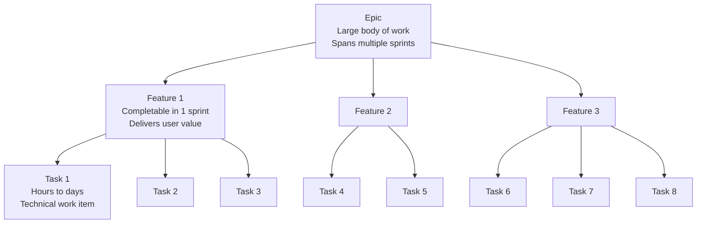
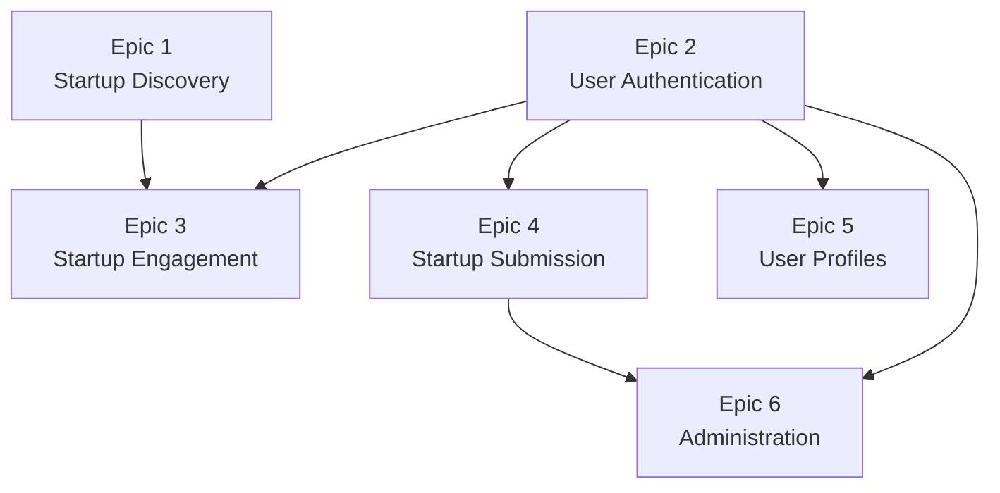
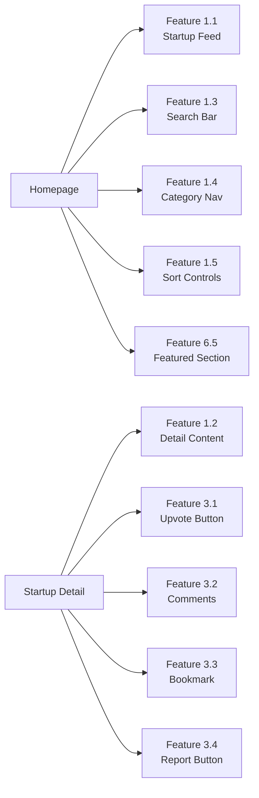

# Feature Breakdown: From Stories to Tasks

User stories tell us what to build. But a story like "As a founder, I want to submit my startup" encompasses dozens of decisions — form fields, validation rules, file uploads, review workflows, database operations, and UI design. Development teams need a way to break large chunks of work into manageable, trackable pieces. That's where the hierarchy of epics, features, and tasks comes in. In this lesson, we'll decompose LaunchPad into a structured work breakdown that maps cleanly to screens, sprints, and individual developer assignments.

## What You'll Learn

- The hierarchy of epics, features, and tasks
- How to decompose user stories into actionable work items
- A complete epic and feature breakdown for LaunchPad
- Feature-to-screen mapping for every page in the application
- How to define MVP scope versus future releases
- Rough estimation techniques for planning

## Concepts

### The Work Breakdown Hierarchy

Software projects use a three-level hierarchy to organize work:

Epics are large bodies of work that represent a major area of functionality. An epic typically spans multiple sprints and contains several related features. Think of an epic as a chapter in a book — it has a coherent theme but contains many individual sections. Examples: "Startup Discovery," "User Authentication," "Admin Moderation."

Features are specific capabilities within an epic. A feature is usually small enough to be completed in one sprint (1-2 weeks) but large enough to deliver meaningful value. Features often correspond directly to user stories. Examples: "Search startups by keyword," "Multi-step startup submission form," "Approve/reject startup submissions."

Tasks are the individual units of work that a developer picks up. A task should be completable in a few hours to a couple of days. Tasks are concrete and technical: "Create the startups database table," "Build the search input component," "Write the POST /api/startups endpoint." Tasks don't deliver value on their own — they combine to complete a feature.

This hierarchy serves multiple purposes. It helps project managers track progress at different levels of detail. It helps developers understand how their work fits into the bigger picture. And it helps the team estimate timelines by breaking unknowns into smaller, estimable pieces.

### How Stories Map to This Hierarchy

User stories and the epic/feature/task hierarchy complement each other:

- An epic encompasses multiple related user stories
- A user story typically maps to one feature (sometimes two)
- A feature breaks down into multiple tasks

For example, the epic "Startup Discovery" encompasses user stories V1 (browse startups), V3 (search), and V4 (filter by category). The user story "Search for startups" maps to the feature "Search functionality." That feature breaks into tasks like "Build search API endpoint," "Create search UI component," "Implement search result highlighting," and "Add search analytics tracking."

### Screen Mapping

Every feature ultimately manifests on a screen. Mapping features to screens ensures nothing falls through the cracks and helps designers and developers coordinate. A single screen often contains elements from multiple features: the homepage includes the startup feed (discovery feature), the search bar (search feature), category navigation (filtering feature), and a "Submit" button (submission feature).

Screen mapping also reveals shared components. If the startup card appears on the homepage, search results, category pages, and user profiles, that's a reusable component that should be built once and shared across screens.

## Step by Step

### Step 1: Defining the Epics

LaunchPad breaks into six major epics. Each one represents a distinct area of functionality that could be assigned to a team or a phase of development.

Epic 1: Startup Discovery

This epic covers everything related to finding and viewing startups. It's the read-only, public-facing core of the platform. When a visitor lands on LaunchPad, every interaction they have before signing up falls under this epic.

The scope includes the homepage startup feed with sorting and pagination, the startup detail page with all content sections, search functionality with keyword matching and result display, category browsing and filtering, and sorting options (newest, most upvoted, trending).

This epic depends on having startup data in the database, which means the database schema and seed data must exist first. It has no dependency on authentication — visitors can discover startups without an account.

Epic 2: User Authentication

This epic covers account creation, login, logout, session management, and password reset. It's foundational — almost every other epic depends on knowing who the user is.

The scope includes signup with email and password, login with session persistence, logout functionality, password reset via email, and role-based access control (visitor, user, founder, admin).

Authentication must be built early because upvoting, commenting, submitting, and admin features all require it.

Epic 3: Startup Engagement

This epic covers the interactive features that registered users use to engage with startups. Upvoting and commenting are the primary engagement mechanisms that create the community dynamic.

The scope includes upvoting and un-upvoting startups, the comment system with threading, saving startups to favorites, and reporting inappropriate content.

This epic depends on both authentication (users must be logged in) and discovery (the startup detail page must exist to host these features).

Epic 4: Startup Submission

This epic covers the founder's workflow for adding startups to the platform. It includes the multi-step form, file uploads, the submission review process, and post-submission editing.

The scope includes the multi-step submission form, logo and screenshot uploads with validation, the submission preview and confirmation, edit functionality for published startups, and the founder dashboard with startup management.

This epic depends on authentication (founders must be logged in) and has a connection to the admin epic (submissions need to be reviewed).

Epic 5: User Profiles

This epic covers personal pages and account management. Users need to see their activity, founders need to showcase their startups, and everyone needs basic account settings.

The scope includes the public profile page with activity tabs, profile editing (name, bio, avatar), the founder profile with submitted startups, and account settings (password change, email update).

This epic depends on authentication and has connections to the engagement epic (displaying upvoted startups and comments on profile pages).

Epic 6: Administration

This epic covers all admin-facing functionality. Admins keep the platform running smoothly by moderating content, managing categories, and monitoring platform health.

The scope includes the submission review queue, category management (create, edit, delete, reorder), content moderation for reported items, platform analytics dashboard, and featuring startups on the homepage.

This epic depends on authentication (admin role) and connects to nearly every other epic since admins oversee all content.

### Step 2: Breaking Epics into Features and Tasks

Now let's break each epic into its features, and each feature into tasks. This is where the work becomes concrete enough to assign and estimate.

Epic 1: Startup Discovery — Features and Tasks

Feature 1.1: Homepage Startup Feed

Tasks:
- Design the startup card component (logo, name, tagline, category badge, upvote count)
- Create the GET /api/startups endpoint with pagination support
- Build the homepage layout with card grid and responsive design
- Implement tab navigation for time periods (Today, This Week, This Month, All Time)
- Add loading skeleton states while data is fetching
- Implement infinite scroll or "Load More" pagination
- Add empty state for when no startups match the selected period
- Optimize card rendering for large lists

Feature 1.2: Startup Detail Page

Tasks:
- Create the GET /api/startups/:slug endpoint returning full startup data with related entities
- Build the detail page header section (logo, name, tagline, external link, stats)
- Build the description section with rich text rendering
- Build the screenshot gallery with lightbox for full-size viewing
- Build the team/founder information section
- Add meta tags for SEO (title, description, Open Graph images)
- Add breadcrumb navigation showing the path back to the category or homepage
- Implement related startups section at the bottom of the page

Feature 1.3: Search Functionality

Tasks:
- Create the GET /api/startups/search endpoint with query parameter
- Implement full-text search in PostgreSQL using tsvector and tsquery
- Build the search input component in the navigation bar with debounced input
- Build the search results page with result count and query display
- Implement search result text highlighting
- Add search result sorting options (relevance, newest, most upvoted)
- Build the empty state with search suggestions and alternative queries
- Track search queries in analytics for improving results

Feature 1.4: Category Browsing

Tasks:
- Create the GET /api/categories endpoint returning all categories with startup counts
- Build the category navigation component for sidebar or top navigation
- Build the category page layout with category header, description, and icon
- Create the GET /api/categories/:slug/startups endpoint with pagination
- Implement category filtering on the startup feed API
- Add category badges to startup cards that link to the category page
- Build a "Browse All Categories" page with a grid of category cards

Feature 1.5: Sorting and Filtering

Tasks:
- Add sort parameter to the startups API (newest, upvotes, trending, comments)
- Implement the trending score algorithm (weighted combination of recency and upvotes)
- Build the sort dropdown component for use across all listing pages
- Build the advanced filter panel (date range, upvote count threshold)
- Persist filter and sort selections in URL query parameters for shareability
- Sync URL state with filter UI on page load

Epic 2: User Authentication — Features and Tasks

Feature 2.1: User Registration

Tasks:
- Create the users database table with email, password_hash, name, role, and timestamps
- Create the POST /api/auth/signup endpoint with input validation
- Implement password hashing with bcrypt (cost factor 12)
- Build the signup page with form fields and inline validation messages
- Add email uniqueness check with friendly error message
- Send welcome email on successful registration
- Redirect to homepage after signup with authenticated session
- Add password strength indicator to the signup form

Feature 2.2: Login and Session Management

Tasks:
- Create the POST /api/auth/login endpoint with credential verification
- Implement session token generation and storage in Redis
- Build the login page with email and password fields
- Implement persistent sessions with configurable expiration (7 days default)
- Add the authenticated user avatar and dropdown menu to the navigation bar
- Create the POST /api/auth/logout endpoint that clears the session
- Handle session expiration gracefully with redirect to login
- Store intended redirect URL so users return to their previous page after login

Feature 2.3: Password Reset

Tasks:
- Create the POST /api/auth/forgot-password endpoint
- Generate and store password reset tokens with 1-hour expiration
- Send password reset email with secure, one-time-use link
- Build the "Forgot Password" page with email input and confirmation message
- Build the "Reset Password" page with new password and confirmation fields
- Create the POST /api/auth/reset-password endpoint with token validation
- Invalidate reset token after successful use
- Handle expired or invalid tokens with clear user feedback

Feature 2.4: Role-Based Access Control

Tasks:
- Define role enum (visitor, user, founder, admin) in the database schema
- Create authentication middleware that verifies session tokens from cookies
- Create authorization middleware that checks user roles against required roles
- Protect API endpoints with appropriate role requirements
- Build frontend route guards for authenticated and role-specific pages
- Handle unauthorized access with appropriate error messages or redirect
- Create utility functions for checking permissions in UI components

Epic 3: Startup Engagement — Features and Tasks

Feature 3.1: Upvoting System

Tasks:
- Create the upvotes database table (user_id, startup_id, unique constraint, timestamps)
- Create the POST /api/startups/:id/upvote endpoint that toggles the upvote
- Update the startup's denormalized upvote_count on each toggle
- Build the upvote button component with optimistic UI update (instant feedback)
- Show the "upvoted" visual state when the current user has already upvoted
- Add a subtle animation on upvote for satisfying feedback
- Handle upvote attempt when not logged in with a login prompt modal
- Ensure upvote count stays in sync across multiple browser tabs

Feature 3.2: Comment System

Tasks:
- Create the comments database table (id, startup_id, user_id, parent_id, content, is_pinned, timestamps)
- Create the POST /api/startups/:id/comments endpoint with content validation
- Create the GET /api/startups/:id/comments endpoint with nested threading support
- Build the comment input component with character count (max 2000 characters)
- Build the comment display component with author avatar, name, and relative timestamp
- Implement comment threading — replies appear nested below their parent
- Build the inline reply input that appears when clicking "Reply" on a comment
- Add comment deletion for comment authors with confirmation
- Add the "Founder" badge that appears on founder replies to their own startup
- Implement comment sorting (newest first, oldest first)
- Update the startup's denormalized comment_count on create and delete

Feature 3.3: Favorites / Bookmarks

Tasks:
- Create the favorites database table (user_id, startup_id, unique constraint, timestamps)
- Create the POST /api/startups/:id/favorite endpoint that toggles the favorite
- Create the GET /api/users/me/favorites endpoint returning saved startups
- Build the bookmark icon component on startup cards and detail pages
- Build the "Saved" tab on the user profile page
- Show empty state when no startups are saved with a call-to-action to browse

Feature 3.4: Content Reporting

Tasks:
- Create the reports database table (reporter_id, content_type, content_id, reason, status, timestamps)
- Create the POST /api/reports endpoint with validation
- Build the "Report" button on comments (accessible via a three-dot menu)
- Build the report modal with reason selection (spam, harassment, inappropriate, other)
- Show confirmation message after submitting a report
- Prevent duplicate reports from the same user for the same content

Epic 4: Startup Submission — Features and Tasks

Feature 4.1: Multi-Step Submission Form

Tasks:
- Build the form wizard component with step navigation, back/next buttons, and progress indicator
- Build Step 1 — Basic Info: startup name (required, max 150 chars), tagline (required, max 120 chars), website URL (required, valid URL format)
- Build Step 2 — Description: rich text editor with formatting toolbar for the full startup description
- Build Step 3 — Media uploads (detailed in Feature 4.2)
- Build Step 4 — Categorization: primary category selection dropdown, tag input with autocomplete (up to 5 tags)
- Build Step 5 — Review and preview: display all entered data formatted as it will appear on the detail page
- Create the POST /api/startups endpoint for creating new startup submissions
- Implement form state persistence using localStorage for draft saving
- Handle submission success with a confirmation page showing the "pending review" status
- Add form validation that prevents proceeding to the next step with invalid data

Feature 4.2: Media Uploads

Tasks:
- Set up file upload infrastructure (presigned URLs for direct-to-storage upload)
- Build the logo upload component with drag-and-drop zone and click-to-browse
- Show image preview immediately after selection, before upload completes
- Implement logo validation (minimum 200x200 pixels, max 5MB, accepted formats: JPG, PNG, WebP)
- Build the screenshot upload component supporting up to 5 images
- Implement screenshot reordering via drag-and-drop
- Add image compression and optimization on upload to reduce file sizes
- Show upload progress bars and handle error states (network failure, invalid format)
- Allow removing uploaded images with a single click

Feature 4.3: Founder Dashboard

Tasks:
- Build the dashboard layout with sidebar navigation and responsive design
- Create the GET /api/founders/me/startups endpoint returning all startups for the authenticated user
- Build the startup list view with status indicators (pending: yellow, approved: green, rejected: red)
- Build the edit functionality that pre-fills the submission form with existing startup data
- Create the PUT /api/startups/:id endpoint for updating startup information
- Build the analytics summary view (total upvotes, total comments, view count per startup)
- Display admin rejection feedback for rejected startups with a "Re-submit" button
- Handle the case where a founder has no startups yet with a call-to-action to submit one

Epic 5: User Profiles — Features and Tasks

Feature 5.1: Public Profile Page

Tasks:
- Create the GET /api/users/:username endpoint returning public profile data
- Build the profile header section (avatar, display name, bio, member since date)
- Build the "Upvoted" tab showing startups the user has upvoted (paginated)
- Build the "Comments" tab showing the user's comment history with links to startup pages
- Build the "Submitted" tab (visible only for founders) showing their startups with status
- Add an "Edit Profile" link visible only when viewing your own profile
- Handle profiles for users who don't exist with a 404 page

Feature 5.2: Profile Editing

Tasks:
- Build the profile settings page accessible from the user dropdown menu
- Create the PUT /api/users/me endpoint with field validation
- Build the avatar upload component with crop and resize functionality
- Build the form for editing display name (required) and bio (optional, max 500 chars)
- Implement client-side and server-side validation with error messages
- Show success toast notification after saving changes

Feature 5.3: Account Settings

Tasks:
- Build the account settings page as a separate tab from profile settings
- Implement password change (requires current password, validates new password)
- Implement email change with re-verification email to the new address
- Add account deletion with a confirmation dialog that requires typing "DELETE" to confirm
- Create the respective API endpoints for each account action
- Handle edge cases (wrong current password, email already in use)

Epic 6: Administration — Features and Tasks

Feature 6.1: Submission Review Queue

Tasks:
- Create the GET /api/admin/submissions endpoint returning pending startups (paginated, newest first)
- Build the admin layout with sidebar navigation (Overview, Submissions, Categories, Reports)
- Build the submission queue list view with startup name, founder, date, and preview button
- Build the full submission review page showing the complete listing preview
- Create the POST /api/admin/submissions/:id/approve endpoint
- Create the POST /api/admin/submissions/:id/reject endpoint with required reason text
- Send email notification to the founder on approval or rejection
- Add bulk action support (approve or reject multiple submissions at once)
- Show the count of pending submissions as a badge in the sidebar navigation

Feature 6.2: Category Management

Tasks:
- Create the full CRUD API for categories (POST, GET, PUT, DELETE /api/admin/categories)
- Build the category list with drag-to-reorder functionality
- Build the add/edit category form (name, slug auto-generated, description, icon/emoji selector)
- Handle category deletion — prompt to reassign startups to another category if any exist
- Validate category name uniqueness with friendly error messages
- Show startup count next to each category in the list

Feature 6.3: Content Moderation

Tasks:
- Create the GET /api/admin/reports endpoint returning pending reports
- Build the reports queue showing the reported content with report details
- Build the report detail view with original content, report reason, reporter info, and content author info
- Create the POST /api/admin/reports/:id/resolve endpoint (action: remove_content or dismiss)
- Send notification to content author if their content is removed
- Send notification to reporter when their report is reviewed
- Group multiple reports for the same content into a single review item

Feature 6.4: Platform Analytics Dashboard

Tasks:
- Create the GET /api/admin/analytics endpoint with date range query parameters
- Build the overview cards (total users, total startups, total upvotes, total comments) with trend arrows
- Build the growth chart showing new users and new startups over time (line chart)
- Build the recent activity feed (last 50 actions: signups, submissions, upvotes)
- Implement the date range picker for filtering all analytics data
- Add comparison to previous period (e.g., "up 15% from last week")

Feature 6.5: Featured Startups

Tasks:
- Add an is_featured boolean column and featured_at timestamp to the startups table
- Create the POST /api/admin/startups/:id/feature endpoint (toggle)
- Build the admin featured startup management UI with search and toggle controls
- Build the "Featured" section on the homepage with distinct visual treatment
- Limit the number of simultaneously featured startups (maximum 5)
- Automatically unfeature startups after a configurable period (e.g., 7 days)

### Step 3: Feature-to-Screen Mapping

Now let's map every feature to the screen where it appears. This ensures that when a developer works on a screen, they know exactly which features it needs to support.

Here is the complete screen-to-feature mapping:

Homepage
- Startup feed with cards (Feature 1.1)
- Search bar in navigation (Feature 1.3)
- Category navigation links (Feature 1.4)
- Sort controls with time period tabs (Feature 1.5)
- Featured startups section (Feature 6.5)
- Login/Signup buttons or authenticated user avatar (Feature 2.1, 2.2)
- "Submit Startup" call-to-action button (Feature 4.1)

Startup Detail Page
- Full startup content display — logo, name, description, screenshots, team (Feature 1.2)
- Upvote button with count (Feature 3.1)
- Comments section with threading (Feature 3.2)
- Bookmark/save button (Feature 3.3)
- Report button on comments (Feature 3.4)
- Founder badge on founder replies (Feature 3.2)
- Related startups section (Feature 1.2)

Category Page
- Category header with name, description, and icon (Feature 1.4)
- Filtered startup feed showing only startups in this category (Feature 1.1, 1.4)
- Sort controls (Feature 1.5)

Search Results Page
- Search input pre-filled with query (Feature 1.3)
- Matching startups with highlighted text (Feature 1.3)
- Sort and filter controls (Feature 1.5)
- Empty state with suggestions (Feature 1.3)

Signup Page
- Registration form with name, email, password fields (Feature 2.1)
- Link to login page for existing users (Feature 2.2)

Login Page
- Login form with email and password fields (Feature 2.2)
- Link to signup and forgot password pages (Feature 2.1, 2.3)

Forgot Password Page
- Email input for initiating password reset (Feature 2.3)

Reset Password Page
- New password form with token validation (Feature 2.3)

Submit Startup Page (multi-step)
- Step 1: Basic info form — name, tagline, URL (Feature 4.1)
- Step 2: Rich text description editor (Feature 4.1)
- Step 3: Logo and screenshot uploads with drag-and-drop (Feature 4.2)
- Step 4: Category selection and tag input (Feature 4.1)
- Step 5: Preview and submit (Feature 4.1)

User Profile Page
- Profile header with avatar, name, bio, join date (Feature 5.1)
- "Upvoted" tab — startups this user has upvoted (Feature 5.1)
- "Comments" tab — this user's comment history (Feature 5.1)
- "Submitted" tab — founder's startups with status (Feature 5.1)
- "Saved" tab — bookmarked startups (Feature 3.3)

Profile Settings Page
- Edit display name, bio, and avatar (Feature 5.2)

Account Settings Page
- Change password, change email, delete account (Feature 5.3)

Founder Dashboard
- Startup list with status indicators (Feature 4.3)
- Edit startup link for each listing (Feature 4.3)
- Analytics summary per startup (Feature 4.3)

Admin Dashboard — Overview
- Platform metrics cards with trends (Feature 6.4)
- Growth charts (Feature 6.4)
- Recent activity feed (Feature 6.4)

Admin Dashboard — Submissions Queue
- Pending startup list with preview (Feature 6.1)
- Submission review detail page (Feature 6.1)
- Approve/reject controls with reason input (Feature 6.1)

Admin Dashboard — Categories
- Category list with drag-to-reorder (Feature 6.2)
- Add/edit category form (Feature 6.2)

Admin Dashboard — Reports
- Reports queue showing flagged content (Feature 6.3)
- Report detail with moderation actions (Feature 6.3)

Admin Dashboard — Featured
- Search and feature/unfeature startup controls (Feature 6.5)

That gives us approximately 20 distinct screens. Some screens share components — the startup card component appears on at least 5 different screens, and the navigation bar with search appears on every page. This is exactly why screen mapping matters: it reveals opportunities for reusable components.

Shared Components (used across multiple screens):
- Navigation Bar — every page
- Startup Card — homepage, category page, search results, profile tabs, saved tab
- Search Input — navigation bar (all pages), search results page
- Upvote Button — startup card, startup detail page
- Bookmark Icon — startup card, startup detail page
- Category Badge — startup card, startup detail page
- User Avatar — navigation bar, comments, profile page
- Pagination / Load More — startup feeds, comments, admin queues

### Step 4: Defining MVP Scope

Not everything above goes into the first release. Using our MoSCoW priorities from the previous lesson, here's what's in the MVP and what's deferred.

MVP Scope — Must Have Features:
- Epic 1: Features 1.1, 1.2, 1.3, 1.4 (feed, detail, search, categories)
- Epic 2: Features 2.1, 2.2, 2.4 (signup, login, role-based access)
- Epic 3: Feature 3.1 (upvoting)
- Epic 4: Features 4.1, 4.2 (submission form with uploads)
- Epic 6: Features 6.1, 6.2 (submission review, category management)

MVP Screens (10 screens):
- Homepage
- Startup Detail Page
- Category Page
- Search Results Page
- Signup Page
- Login Page
- Submit Startup Page (all 5 steps)
- Admin — Submissions Queue
- Admin — Categories

Deferred to Post-MVP Releases:
- Feature 1.5: Advanced sorting and trending algorithm
- Feature 2.3: Password reset flow
- Feature 3.2: Comment system with threading
- Feature 3.3: Favorites and bookmarks
- Feature 3.4: Content reporting
- Feature 4.3: Founder dashboard with analytics
- Feature 5.1-5.3: User profiles and account settings
- Feature 6.3-6.5: Moderation, analytics dashboard, featured startups

This might seem like a lot is deferred, but the MVP still delivers a complete product loop. Users can discover startups by browsing, searching, and filtering by category. They can show support through upvotes. Founders can submit startups with logos and screenshots. Admins can review submissions and manage categories. That's a functional startup directory that delivers value on day one.

The post-MVP features add depth: community engagement (comments, favorites), founder empowerment (dashboard, analytics), user personalization (profiles, settings), and admin sophistication (moderation, platform analytics, featured content). These make the product significantly better but the core value proposition works without them.

### Step 5: Estimating the Work

A rough estimate helps set expectations and plan timelines. Here's how the MVP features break down by development effort. These are estimates for a single developer working full-time.

Epic 1 — Discovery (Features 1.1-1.4):
- Approximately 30 tasks
- Estimated effort: 3-4 weeks
- The homepage feed and detail page are the most work-intensive. Search adds a week due to full-text search implementation. Categories are relatively straightforward CRUD.

Epic 2 — Authentication (Features 2.1, 2.2, 2.4):
- Approximately 15 tasks
- Estimated effort: 1-2 weeks
- Authentication is well-understood territory with established patterns and libraries. The role-based access middleware is the most complex piece, requiring careful thought about which routes need which roles.

Epic 3 MVP — Upvoting Only (Feature 3.1):
- Approximately 7 tasks
- Estimated effort: 3-4 days
- The upvote feature is relatively straightforward: a join table, a toggle endpoint, and a button component with optimistic updates.

Epic 4 MVP — Submission (Features 4.1, 4.2):
- Approximately 20 tasks
- Estimated effort: 2-3 weeks
- The multi-step form is UI-intensive with validation at each step. File uploads add significant complexity with storage configuration, image validation, and progress handling.

Epic 6 MVP — Admin Basics (Features 6.1, 6.2):
- Approximately 12 tasks
- Estimated effort: 1-2 weeks
- The submission queue and category management are relatively straightforward CRUD interfaces with an admin layout.

Total MVP Estimate:
- Approximately 84 tasks
- One developer: 8-12 weeks
- Two developers: 5-7 weeks
- Three developers: 4-5 weeks

These are rough, ballpark figures. Actual timelines depend on developer experience, design decisions, unforeseen technical challenges, and how much time goes to testing and polish. Professional teams typically add a 20-30% buffer to account for the unexpected.

The value of this estimate isn't precision — it's order of magnitude. We now know this is a "2-3 month" project, not a "2 week" project or a "2 year" project. That information shapes staffing decisions, deadline commitments, and stakeholder expectations.

## Try It Yourself

Exercise: Create a Detailed Task Breakdown for One Epic

Pick one of the six epics (or choose the one you find most interesting) and create a task breakdown that goes deeper than what we've covered above.

For each task, include:

1. A clear, specific description of what needs to be done
2. An estimate in hours (2, 4, 8, 16, or 24 hours)
3. Dependencies — which other tasks must be completed before this one can start
4. Type — frontend task, backend task, database task, or full-stack task

Example format:

Epic 3, Feature 3.2: Comment System

Task 3.2.1: Create comments database table
- Description: Write the SQL migration for the comments table with columns for id (UUID), startup_id (FK), user_id (FK), parent_id (FK, nullable for threading), content (TEXT), is_pinned (BOOLEAN), created_at, and updated_at. Add foreign key constraints to users, startups, and self-referencing comments. Add indexes on startup_id, parent_id, and user_id.
- Estimate: 2 hours
- Dependencies: Users table and startups table must exist (Tasks from Epic 2 and database setup)
- Type: Database

Task 3.2.2: Build the POST /api/startups/:id/comments endpoint
- Description: Create the API endpoint that accepts comment content (string, 1-2000 chars) and optional parent_id (UUID). Validate that the startup exists and is approved, the user is authenticated, and the content meets length requirements. If parent_id is provided, validate the parent comment exists and belongs to the same startup. Insert the comment and increment the startup's comment_count. Return the created comment with author info.
- Estimate: 4 hours
- Dependencies: Task 3.2.1 (database table), authentication middleware (Feature 2.4)
- Type: Backend

Continue in this style for at least 8-10 tasks within your chosen epic. Pay attention to the dependencies — you'll often find that database tasks must be done before API tasks, and API tasks must be done before frontend tasks that consume them.

Bonus: Draw a dependency graph on paper showing which tasks can be done in parallel and which must be sequential. If you had two developers, how would you split the work so both stay productive without blocking each other? This is exactly how development leads plan sprint work in real teams.

## Key Takeaways

- Epics, features, and tasks form a hierarchy that makes large projects manageable — epics are themes, features are capabilities, tasks are individual work items
- LaunchPad breaks into six epics: Discovery, Authentication, Engagement, Submission, Profiles, and Administration
- Each feature maps to one or more screens, and each screen often contains elements from multiple features
- Screen mapping reveals shared components (like the startup card) that should be built once and reused across the application
- The MVP includes 10 Must Have features across 10 screens — enough for a functional startup directory with a complete user loop
- Estimating tasks at the individual level aggregates into realistic project timelines
- Dependencies between tasks determine the order of development — database before API, API before frontend
- Even rough estimates provide valuable order-of-magnitude planning information

## Next Steps

We now know what to build (user stories), how to organize the work (epics, features, and tasks), and which screens to create (feature-to-screen mapping). The final piece of system thinking is the data model. In the next lesson, we'll identify every entity in LaunchPad, define their attributes and relationships, and create an entity-relationship diagram. The data model is the foundation that everything else is built on — get it right, and the database schema, API responses, and frontend components all flow naturally from it.
