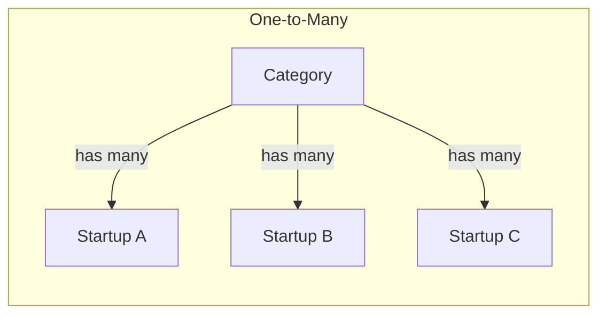
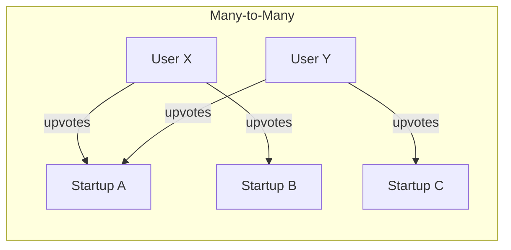
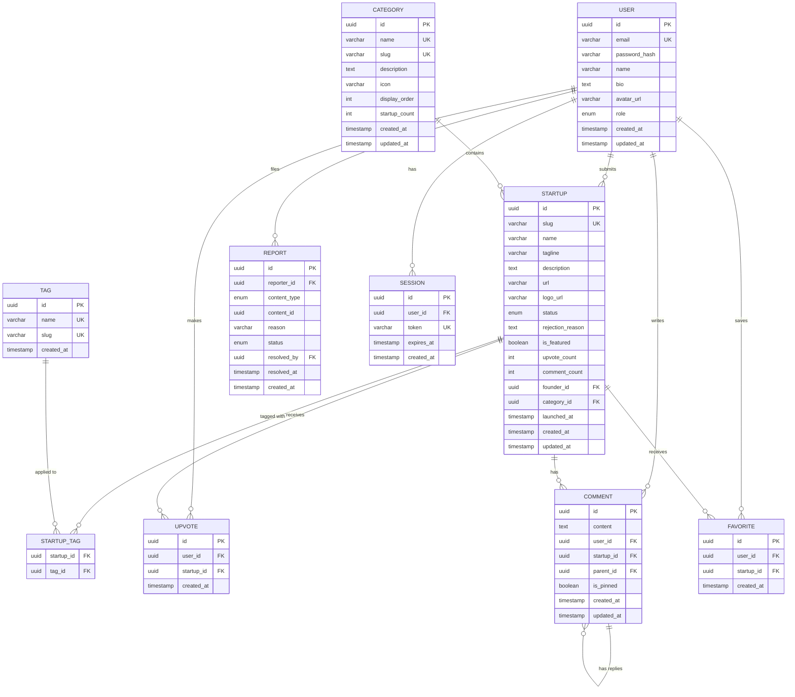

# Data Modeling: Entities, Relationships, and the ERD

Every application is, at its core, a system for storing, retrieving, and manipulating data. The decisions you make about how to structure that data ripple through everything — your database queries, your API responses, your form fields, your component props. A well-designed data model makes the entire application easier to build and maintain. A poorly designed one creates pain at every layer. In this lesson, we'll identify every entity in LaunchPad, define their attributes and relationships, build a complete entity-relationship diagram, and discuss the principles that make a data model robust.

## What You'll Learn

- What entities, attributes, and relationships are
- How to identify entities from user stories and feature requirements
- The complete LaunchPad data model with all fields and types
- One-to-many and many-to-many relationship patterns
- How to read and create entity-relationship diagrams using Mermaid
- Primary keys, foreign keys, and indexes
- Database normalization basics (1NF, 2NF, 3NF)

## Concepts

### What Is a Data Model?

A data model is a blueprint for how your application's data is organized. It defines three things:

Entities are the "things" your application tracks. In LaunchPad, a Startup is an entity. A User is an entity. A Category is an entity. If you can say "the system needs to store information about X," then X is probably an entity. Entities become tables in a relational database.

Attributes are the properties of an entity. A User entity has attributes like email, name, and password_hash. A Startup has attributes like name, tagline, description, and url. Attributes become columns in a database table.

Relationships describe how entities connect to each other. A User creates a Startup (one-to-many). A Startup belongs to a Category (many-to-one). A User upvotes a Startup (many-to-many). Relationships become foreign keys and join tables in the database.

### Why Model Before You Code?

It's tempting to start building and figure out the data structure as you go. This always leads to problems:

You'll need to add columns mid-project, requiring database migrations that might break existing data. You'll discover missing relationships when building a feature that needs to join data across tables you didn't connect. You'll build inconsistent API responses because you didn't think through which data belongs together. You'll create duplicate data because you didn't plan for normalization.

Taking the time to model your data upfront saves exponentially more time during development. The model we create in this lesson will directly inform the database schema in Course 02, the API endpoints in Course 03, and the TypeScript types in Course 05.

### Relationship Types

Relational databases support three types of relationships:

One-to-One means each record in Table A relates to exactly one record in Table B, and vice versa. This is relatively rare. An example would be a User and a UserSettings table — each user has exactly one settings record. In practice, one-to-one data is often stored in the same table unless there's a reason to separate it (like infrequently accessed large data blobs).

One-to-Many (or Many-to-One, depending on which direction you read it) means each record in Table A can relate to many records in Table B, but each record in Table B relates to only one record in Table A. This is the most common relationship type. A Category has many Startups, but each Startup belongs to exactly one Category. It's implemented with a foreign key on the "many" side — the startups table has a category_id column pointing to the categories table.

Many-to-Many means records in Table A can relate to multiple records in Table B, and vice versa. A User can upvote many Startups, and a Startup can be upvoted by many Users. Relational databases can't represent this directly with foreign keys alone. Instead, you create a join table (also called a junction table or associative table) that sits between the two entities. An upvotes table with user_id and startup_id columns creates the many-to-many link.





## Step by Step

### Step 1: Identifying Entities

Let's go through our user stories and features to identify every entity LaunchPad needs. The process is straightforward: look for the nouns. If you hear "a user submits a startup," that's two entities: User and Startup. If you hear "startups are organized by category," that's another entity: Category.

Here are the entities we need:

User — Anyone who creates an account on LaunchPad. This covers registered users, founders, and admins (differentiated by a role attribute rather than separate tables, since a founder is just a user who has submitted a startup).

Startup — A product listing submitted by a founder. This is the core content of the platform — the "thing" that everything revolves around.

Category — A classification for organizing startups (e.g., "AI Tools," "SaaS," "Fintech"). Categories are managed by admins and each startup belongs to exactly one category.

Tag — A flexible label that founders apply to their startups. Unlike categories (which are admin-controlled and limited to one per startup), tags are more free-form and a startup can have many. Examples: "open-source," "freemium," "B2B," "mobile-first."

Upvote — A record of a user supporting a startup. This is a relationship entity (join table) between User and Startup, but it also carries its own data (the timestamp of when the upvote happened).

Comment — A piece of feedback or discussion on a startup's page. Comments support threading via a self-referential relationship (a comment can be a reply to another comment).

Favorite — A record of a user saving a startup for later. Like Upvote, this is a relationship entity between User and Startup.

Report — A moderation record created when a user flags inappropriate content. References the reporter, the type of content, and the content's identifier.

Session — An authentication record tracking logged-in users. Managed by the auth system for login persistence across browser sessions.

We could also identify additional entities — TeamMember (for listing co-founders on a startup page), Notification (for alerting users about activity on their content), or ActivityLog (for tracking every event on the platform). But following our MVP scope, we'll focus on the eight core entities plus Session. Additional entities can be added later without disrupting the core model.

### Step 2: Defining Attributes for Each Entity

Let's define every field for each entity, including the data type, constraints, and the reasoning behind each choice. These will map directly to database columns in Course 02.

User Entity

| Field | Type | Constraints | Purpose |
|-------|------|-------------|---------|
| id | UUID | Primary Key | Unique identifier for each user |
| email | VARCHAR(255) | Unique, Not Null | Login credential and contact method |
| password_hash | VARCHAR(255) | Not Null | Bcrypt hash of the user's password |
| name | VARCHAR(100) | Not Null | Display name shown in UI |
| bio | TEXT | Nullable | Optional self-description |
| avatar_url | VARCHAR(500) | Nullable | URL to profile image |
| role | ENUM | Default 'user' | One of: user, founder, admin |
| created_at | TIMESTAMP | Not Null, Default NOW() | Account creation time |
| updated_at | TIMESTAMP | Not Null, Default NOW() | Last modification time |

Why UUIDs instead of auto-incrementing integers? UUIDs are 128-bit values that look like "550e8400-e29b-41d4-a716-446655440000." We use them for several reasons: they don't reveal information about how many records exist (an ID of 47 tells an attacker there are roughly 47 users), they're safe to expose in URLs and API responses, and they can be generated on the client side before the database insert, which simplifies certain patterns like optimistic UI updates.

Why store password_hash instead of the password? We never, under any circumstances, store plain-text passwords. The password_hash field contains the output of bcrypt, a one-way hashing algorithm. Even if the database is breached, attackers cannot reverse the hash to obtain the original password. The hash is always a fixed-length string regardless of password length.

Why is the role an enum rather than a separate roles table? For LaunchPad, users have exactly one role, and the set of roles is small and fixed (user, founder, admin). An enum is simpler and faster than a join to a roles table. If we needed more complex role management — users with multiple roles, custom roles, role hierarchies — a separate table would be the right choice.

Startup Entity

| Field | Type | Constraints | Purpose |
|-------|------|-------------|---------|
| id | UUID | Primary Key | Unique identifier |
| slug | VARCHAR(200) | Unique, Not Null | URL-friendly name (e.g., "my-startup") |
| name | VARCHAR(150) | Not Null | Display name |
| tagline | VARCHAR(120) | Not Null | Brief one-line description |
| description | TEXT | Not Null | Full detailed description |
| url | VARCHAR(500) | Not Null | Startup's website URL |
| logo_url | VARCHAR(500) | Not Null | URL to uploaded logo |
| status | ENUM | Default 'pending' | One of: pending, approved, rejected |
| rejection_reason | TEXT | Nullable | Admin's reason if rejected |
| is_featured | BOOLEAN | Default false | Whether featured on homepage |
| upvote_count | INTEGER | Default 0 | Denormalized count for fast reads |
| comment_count | INTEGER | Default 0 | Denormalized count for fast reads |
| founder_id | UUID | FK to users.id, Not Null | Who submitted this startup |
| category_id | UUID | FK to categories.id, Not Null | Primary category |
| launched_at | TIMESTAMP | Nullable | When approved and made public |
| created_at | TIMESTAMP | Not Null, Default NOW() | Submission time |
| updated_at | TIMESTAMP | Not Null, Default NOW() | Last modification time |

The slug field deserves explanation. URLs like `/startups/550e8400-e29b-41d4` are technically functional but ugly and unmemorable. Slugs like `/startups/launchpad-analytics` are human-readable, SEO-friendly, and shareable. The slug is generated from the startup name by converting to lowercase, replacing spaces with hyphens, removing special characters, and appending a short random suffix if the slug already exists in the database.

The status field controls the startup's lifecycle. New submissions start as "pending." Admins review them and set the status to "approved" (making them publicly visible) or "rejected" (with a reason). This prevents spam and ensures listing quality.

The upvote_count and comment_count fields are intentionally denormalized. In a perfectly normalized database, you'd calculate these counts by running COUNT queries against the upvotes and comments tables. But those COUNT queries would run every time a startup card is displayed — on the homepage, in search results, on category pages. Storing the count directly on the startup table means reading it is a simple column lookup instead of an aggregation query. The trade-off is that we must keep these counts in sync whenever upvotes or comments are added or removed, but this is straightforward with proper application logic.

Category Entity

| Field | Type | Constraints | Purpose |
|-------|------|-------------|---------|
| id | UUID | Primary Key | Unique identifier |
| name | VARCHAR(100) | Unique, Not Null | Display name (e.g., "AI Tools") |
| slug | VARCHAR(100) | Unique, Not Null | URL-friendly version |
| description | TEXT | Nullable | What this category covers |
| icon | VARCHAR(50) | Nullable | Emoji or icon identifier |
| display_order | INTEGER | Not Null, Default 0 | Controls navigation ordering |
| startup_count | INTEGER | Default 0 | Denormalized count |
| created_at | TIMESTAMP | Not Null, Default NOW() | Creation time |
| updated_at | TIMESTAMP | Not Null, Default NOW() | Last modification time |

The display_order field lets admins control the order categories appear in the navigation, independent of alphabetical or creation order. This is a simple integer — categories are sorted by this value in ascending order.

Tag Entity

| Field | Type | Constraints | Purpose |
|-------|------|-------------|---------|
| id | UUID | Primary Key | Unique identifier |
| name | VARCHAR(50) | Unique, Not Null | Tag label (e.g., "open-source") |
| slug | VARCHAR(50) | Unique, Not Null | URL-friendly version |
| created_at | TIMESTAMP | Not Null, Default NOW() | Creation time |

Tags are intentionally lightweight. They're just a name and a slug. The heavy lifting is in the join table that connects tags to startups.

Startup_Tags Join Table

| Field | Type | Constraints | Purpose |
|-------|------|-------------|---------|
| startup_id | UUID | FK to startups.id, Not Null | The tagged startup |
| tag_id | UUID | FK to tags.id, Not Null | The applied tag |

The primary key is a composite of (startup_id, tag_id), which automatically ensures that a tag can only be applied to a startup once. There's no separate id column — the combination of the two foreign keys uniquely identifies each row.

Upvote Entity

| Field | Type | Constraints | Purpose |
|-------|------|-------------|---------|
| id | UUID | Primary Key | Unique identifier |
| user_id | UUID | FK to users.id, Not Null | Who upvoted |
| startup_id | UUID | FK to startups.id, Not Null | What was upvoted |
| created_at | TIMESTAMP | Not Null, Default NOW() | When the upvote happened |

A unique constraint on (user_id, startup_id) ensures a user can only upvote a startup once. The application uses this constraint to implement the toggle behavior — if you try to insert a duplicate, the endpoint removes the existing upvote instead.

Comment Entity

| Field | Type | Constraints | Purpose |
|-------|------|-------------|---------|
| id | UUID | Primary Key | Unique identifier |
| content | TEXT | Not Null | The comment text (1-2000 chars validated in app) |
| user_id | UUID | FK to users.id, Not Null | Comment author |
| startup_id | UUID | FK to startups.id, Not Null | Which startup page |
| parent_id | UUID | FK to comments.id, Nullable | Parent comment for threading |
| is_pinned | BOOLEAN | Default false | Whether founder pinned this |
| created_at | TIMESTAMP | Not Null, Default NOW() | Posting time |
| updated_at | TIMESTAMP | Not Null, Default NOW() | Last edit time |

The parent_id field is the key to threading. When it's NULL, the comment is a top-level comment on the startup. When it contains a UUID, that comment is a reply to the comment with that ID. This creates a tree structure:

```
Comment A (parent_id: NULL)
  Comment B (parent_id: A)
    Comment D (parent_id: B)
  Comment C (parent_id: A)
```

This self-referential relationship (comments referencing comments) is a common pattern for threaded discussions. The API retrieves all comments for a startup and assembles them into a tree on the server or client side.

Favorite Entity

| Field | Type | Constraints | Purpose |
|-------|------|-------------|---------|
| id | UUID | Primary Key | Unique identifier |
| user_id | UUID | FK to users.id, Not Null | Who saved it |
| startup_id | UUID | FK to startups.id, Not Null | What was saved |
| created_at | TIMESTAMP | Not Null, Default NOW() | When it was saved |

Structurally identical to the Upvote entity but representing a different user action. Having separate tables (rather than a single "user_actions" table with a type column) keeps queries simple and allows different behavior in the future (e.g., favorites might get notification preferences that upvotes don't).

Report Entity

| Field | Type | Constraints | Purpose |
|-------|------|-------------|---------|
| id | UUID | Primary Key | Unique identifier |
| reporter_id | UUID | FK to users.id, Not Null | Who filed the report |
| content_type | ENUM | Not Null | One of: comment, startup |
| content_id | UUID | Not Null | ID of the reported content |
| reason | VARCHAR(500) | Not Null | Why it was reported |
| status | ENUM | Default 'pending' | One of: pending, resolved, dismissed |
| resolved_by | UUID | FK to users.id, Nullable | Admin who handled it |
| resolved_at | TIMESTAMP | Nullable | When it was resolved |
| created_at | TIMESTAMP | Not Null, Default NOW() | When filed |

The content_type and content_id pair form a polymorphic reference — the content_id could point to a row in the comments table or the startups table, depending on the content_type value. PostgreSQL cannot enforce referential integrity on polymorphic references because a foreign key must point to a specific table. The application layer must handle this validation. An alternative design would use separate tables (comment_reports and startup_reports), which trades some duplication for database-level integrity enforcement.

Session Entity

| Field | Type | Constraints | Purpose |
|-------|------|-------------|---------|
| id | UUID | Primary Key | Unique identifier |
| user_id | UUID | FK to users.id, Not Null | Who is logged in |
| token | VARCHAR(255) | Unique, Not Null | Session token in cookie |
| expires_at | TIMESTAMP | Not Null | When session expires |
| created_at | TIMESTAMP | Not Null, Default NOW() | Login time |

A user can have multiple active sessions — one for their laptop browser, one for their phone, one for their tablet. Each session has its own token and expiration. The authentication middleware looks up the token from the request cookie, finds the matching session, checks if it's expired, and loads the associated user.

### Step 3: Mapping All Relationships

Let's explicitly document every relationship between entities, including the cardinality and implementation mechanism.

User to Startup: One-to-Many
- A user can submit multiple startups. Each startup has exactly one founder.
- Implementation: founder_id foreign key on the startups table.
- Example: User "Jane" has startups "WidgetCo" and "DataFlow."

Category to Startup: One-to-Many
- A category contains many startups. Each startup belongs to one category.
- Implementation: category_id foreign key on the startups table.
- Example: Category "AI Tools" contains startups "SmartChat" and "VisionAI."

Startup to Tag: Many-to-Many
- A startup can have multiple tags. A tag can be applied to multiple startups.
- Implementation: startup_tags join table with startup_id and tag_id.
- Example: Startup "SmartChat" has tags "ai" and "saas." Tag "ai" also applies to "VisionAI."

User to Startup (via Upvote): Many-to-Many
- A user can upvote many startups. A startup can be upvoted by many users.
- Implementation: upvotes join table with user_id and startup_id.
- The Upvote entity carries its own data (created_at) making it more than a simple join.

User to Comment: One-to-Many
- A user can write many comments. Each comment has exactly one author.
- Implementation: user_id foreign key on the comments table.

Startup to Comment: One-to-Many
- A startup can have many comments. Each comment belongs to one startup.
- Implementation: startup_id foreign key on the comments table.

Comment to Comment: One-to-Many (self-referential)
- A comment can have many replies. Each reply has at most one parent comment.
- Implementation: parent_id foreign key on the comments table referencing comments.id.
- Top-level comments have parent_id set to NULL.

User to Startup (via Favorite): Many-to-Many
- A user can favorite many startups. A startup can be favorited by many users.
- Implementation: favorites join table with user_id and startup_id.

User to Report: One-to-Many
- A user can file many reports. Each report has one reporter.
- Implementation: reporter_id foreign key on the reports table.

User to Session: One-to-Many
- A user can have multiple active sessions. Each session belongs to one user.
- Implementation: user_id foreign key on the sessions table.

### Step 4: The Entity-Relationship Diagram

Here's the complete ERD for LaunchPad. This diagram shows every entity, its key attributes, and all relationships between them.



Reading this diagram: Each box represents a database table. The lines between boxes represent relationships. The symbols on the lines indicate cardinality:

- "||" means "exactly one" (the mandatory side)
- "o{" means "zero or more" (the optional many side)

So "USER ||--o{ STARTUP" reads as: "One User can have zero or more Startups, and each Startup has exactly one User (founder)."

The "COMMENT ||--o{ COMMENT" line represents the self-referential threading relationship — a comment can have zero or more child comments (replies).

### Step 5: Primary Keys, Foreign Keys, and Indexes

These three concepts are the mechanical underpinning of the data model. Understanding them is essential for writing the database schema in Course 02.

Primary Keys uniquely identify each record in a table. Every table must have a primary key. No two rows can have the same primary key value, and a primary key can never be NULL.

We're using UUID v4 for all primary keys. The trade-off compared to auto-incrementing integers is that UUIDs are larger (16 bytes vs 4 bytes) and slightly slower for indexing due to their random nature. For LaunchPad's expected scale (thousands to tens of thousands of records, not billions), this performance difference is negligible. The benefits — safety in URLs, no information leakage, client-side generation — outweigh the costs.

Foreign Keys enforce referential integrity. When the startups table has a foreign key `founder_id REFERENCES users(id)`, the database guarantees that every founder_id value actually exists in the users table. If you try to insert a startup with a founder_id that doesn't exist, the database rejects the operation. Similarly, if you try to delete a user who has startups, the database either prevents the deletion or cascades it (deleting the user's startups too), depending on the ON DELETE policy you configure.

Our foreign keys and their cascade behaviors:

- startups.founder_id references users.id — ON DELETE CASCADE (if user is deleted, their startups are removed)
- startups.category_id references categories.id — ON DELETE RESTRICT (cannot delete a category that has startups)
- startup_tags.startup_id references startups.id — ON DELETE CASCADE
- startup_tags.tag_id references tags.id — ON DELETE CASCADE
- upvotes.user_id references users.id — ON DELETE CASCADE
- upvotes.startup_id references startups.id — ON DELETE CASCADE
- comments.user_id references users.id — ON DELETE CASCADE
- comments.startup_id references startups.id — ON DELETE CASCADE
- comments.parent_id references comments.id — ON DELETE CASCADE (deleting a parent deletes all replies)
- favorites.user_id references users.id — ON DELETE CASCADE
- favorites.startup_id references startups.id — ON DELETE CASCADE
- reports.reporter_id references users.id — ON DELETE SET NULL (keep report even if reporter leaves)
- reports.resolved_by references users.id — ON DELETE SET NULL
- sessions.user_id references users.id — ON DELETE CASCADE

Indexes speed up database queries by creating a sorted data structure that the database can binary-search through, instead of scanning every row. Without an index on `startup_id` in the comments table, finding all comments for a startup requires reading every row in the comments table. With an index, the database jumps directly to the matching rows.

Every primary key and unique constraint automatically creates an index. Beyond those automatic indexes, we need to create indexes for columns that appear in WHERE clauses and JOIN conditions:

Indexes to create:

- startups.founder_id — For the query "Get all startups by this founder"
- startups.category_id — For "Get all startups in this category"
- startups.status — For "Get all pending/approved startups"
- startups.launched_at — For "Sort startups by launch date"
- startups.upvote_count — For "Sort startups by popularity"
- Composite index on startups(status, launched_at) — For the homepage query "Get approved startups sorted by date," which is the most common query in the entire application
- Composite index on startups(status, upvote_count) — For "Get approved startups sorted by upvotes"
- comments.startup_id — For "Get all comments on this startup"
- comments.parent_id — For "Get all replies to this comment"
- comments.user_id — For "Get all comments by this user"
- sessions.expires_at — For "Clean up expired sessions" (periodic maintenance)

The unique constraints on upvotes(user_id, startup_id) and favorites(user_id, startup_id) already create composite indexes that serve both uniqueness enforcement and query optimization.

A note on over-indexing: Every index speeds up reads but slows down writes, because the index must be updated on every INSERT, UPDATE, and DELETE. For a read-heavy application like LaunchPad (many more page views than submissions), the trade-off favors more indexes. For a write-heavy application (like a logging service), you'd want fewer indexes.

### Step 6: Understanding Normalization

Database normalization is the process of organizing data to reduce redundancy and improve integrity. There are several "normal forms," each building on the previous one. For most web applications, achieving Third Normal Form (3NF) provides the right balance of data integrity and practical usability.

First Normal Form (1NF) requires two things: every column contains atomic (indivisible) values, and every row is unique (which is guaranteed by primary keys).

Violation example: Storing tags as a comma-separated string in the startups table like "ai,saas,b2b". This breaks atomicity. You cannot efficiently query "Find all startups tagged 'ai'" because you'd need a LIKE '%ai%' query, which also matches "fair" and "aisle." You can't enforce uniqueness of tags. You can't easily count how many startups use each tag.

Our solution: We created a separate tags table and a startup_tags join table. Each tag is its own row. Each startup-tag relationship is its own row. Every value is atomic.

Second Normal Form (2NF) requires 1NF, plus every non-key column must depend on the entire primary key, not just part of it. This primarily applies to tables with composite primary keys.

Violation example: If the startup_tags table had columns (startup_id, tag_id, tag_name), the tag_name depends only on tag_id, not on the combination of startup_id and tag_id. This is a partial dependency.

Our solution: The startup_tags table only contains the two foreign keys. Tag information lives exclusively in the tags table. No partial dependencies exist.

Third Normal Form (3NF) requires 2NF, plus every non-key column must depend directly on the primary key, not on other non-key columns (no transitive dependencies).

Violation example: If the startups table had both category_id and category_name columns, the category_name depends on category_id, not on the startup's primary key. This means category_name is transitively dependent on the startup ID through category_id. If an admin renames a category, every startup in that category would need to be updated — and if even one is missed, the data is inconsistent.

Our solution: The startups table only stores category_id. To get the category name, the application joins with the categories table. The name is stored once, in one place. Change it there, and every query that joins to it gets the updated name automatically.

Intentional Denormalization

We deliberately violate 3NF in a few specific places, with full awareness of the trade-offs:

The upvote_count column on the startups table is technically derivable by running `SELECT COUNT(*) FROM upvotes WHERE startup_id = ?`. Storing it on the startup itself means the data exists in two places — the count column and the upvotes table. If they ever disagree, we have a data integrity problem.

So why do it? Because counting is expensive at query time. Every time a startup card is displayed, we'd need to run a COUNT query. On the homepage, that means one COUNT query per card, times 20-30 cards visible at once. With denormalized counts, reading the startup row gives us the count for free. The trade-off:

- Read performance: dramatically faster (column lookup vs aggregation query)
- Write complexity: slightly higher (must update the count on every upvote/un-upvote)
- Data integrity risk: the count could theoretically get out of sync

We mitigate the integrity risk with transactional updates (the upvote insert/delete and the count update happen in the same database transaction) and periodic reconciliation (a background job that recalculates counts from the actual tables).

The same reasoning applies to comment_count on startups and startup_count on categories.

The rule of thumb: normalize by default, denormalize with intention and awareness of the trade-offs. Every denormalization should have a clear performance justification and a plan for maintaining consistency.

### Step 7: Schema Design Decisions Worth Discussing

Several design decisions in our model involve trade-offs that are worth understanding, because you'll face similar decisions in your own projects.

Hard Delete vs Soft Delete

Our current model uses hard deletes — when a comment is removed, the row is deleted from the database. It's gone. The alternative is soft delete, where you add a deleted_at TIMESTAMP column (nullable, NULL means "not deleted") and filter out "deleted" rows in every query with `WHERE deleted_at IS NULL`.

Soft delete advantages: audit trail (you can see what was deleted and when), undo capability (restore by setting deleted_at back to NULL), data preservation for analytics.

Soft delete disadvantages: every query needs to remember the WHERE clause (easy to forget, leaking "deleted" data), storage grows without bound, unique constraints become complicated (is a "deleted" email still "taken"?).

For LaunchPad's MVP, hard delete is simpler and sufficient. If moderation requirements grow, we can add soft delete to specific tables (comments, startups) without affecting others.

Polymorphic References

The reports table uses content_type and content_id to reference either a comment or a startup. The database cannot enforce this with a foreign key because foreign keys reference a specific table. If content_type is "comment," content_id should exist in the comments table. If content_type is "startup," it should exist in the startups table. But the database has no way to enforce this conditional logic.

Alternative: Create separate tables — comment_reports and startup_reports. This gives you proper foreign keys and database-level integrity. The trade-off is duplication of the report structure (reason, status, resolved_by, etc.) across two tables.

For LaunchPad, reports are a secondary feature with relatively low volume. The pragmatism of a single table outweighs the lack of database-level enforcement. Application-level validation ensures the content_id is valid.

Slug Generation Strategy

Both startups and categories use slug fields for URL-friendly identifiers. A slug like "my-awesome-startup" is generated from the name "My Awesome Startup" through these steps:

1. Convert to lowercase: "my awesome startup"
2. Replace spaces with hyphens: "my-awesome-startup"
3. Remove special characters: "my-awesome-startup" (no change needed here)
4. Check for uniqueness in the database
5. If a slug already exists, append a short random suffix: "my-awesome-startup-x7k2"

This logic lives in the application layer, not the database. The database only enforces that the resulting slug is unique (via the unique constraint).

Timestamps Convention

Every table has created_at. Most have updated_at. This consistency enables debugging ("when was this record last changed?"), auditing ("show me all startups approved this week"), and data analysis ("what's our weekly signup rate?").

The created_at value is set once, at insert time, and never changes. The updated_at value is set at insert time and updated on every modification. In PostgreSQL, you can set defaults with `DEFAULT NOW()` and update timestamps using application logic or database triggers.

## Try It Yourself

Exercise: Add a "Review" Entity to the Data Model

LaunchPad currently supports upvotes (a simple "I support this") and comments (text feedback). But what if users could leave structured reviews with a star rating? Think of how the App Store or Amazon handles reviews — a numeric rating plus written feedback.

Your task is to design a Review entity and integrate it into the existing data model. Work through these questions:

1. Define the Review entity's attributes. What fields does it need? Think about the rating (what scale — 1-5 stars? 1-10?), the review text (required or optional?), and timestamps. Write out every field with its data type and constraints, following the same table format used in this lesson.

2. Map the relationships. Which existing entities does Review connect to? A review is written by a User about a Startup — those are two relationships. Can a user review the same startup multiple times? Should founders be allowed to review their own startup? What constraints enforce your decisions?

3. Explain how Review differs from Comment. Both involve a user writing text about a startup. Why might you want both? Think about the different purposes they serve and how they'd appear differently in the UI. Comments are conversational and threaded. Reviews are evaluative and standalone. How does this difference affect the schema?

4. Plan the denormalization. If the homepage card should show "4.5 stars (23 reviews)" alongside the upvote count, what fields do you add to the Startup entity? An average_rating DECIMAL field? A review_count INTEGER? How do you keep these in sync?

5. Draw the updated ERD. On paper or in a Mermaid diagram, add the Review entity to the existing diagram. Show its relationships to User and Startup with proper cardinality notation.

6. Design the indexes. What queries will the application run against the reviews table? "Show all reviews for this startup" (needs index on startup_id). "Show all reviews by this user" (needs index on user_id). "Calculate the average rating for this startup" (needs index on startup_id). List every index you'd create.

Bonus considerations:

- What happens to reviews if a user deletes their account? Should reviews be deleted (losing valuable rating data) or anonymized (preserving ratings but removing personal info)?
- What if a startup is rejected by an admin after receiving reviews? Should the reviews be preserved in case the startup resubmits?
- How would you handle review spam — a user creating multiple accounts to inflate ratings? What database-level and application-level safeguards would you implement?

## Key Takeaways

- Entities are the "things" your application tracks, attributes are their properties, and relationships describe how they connect to each other
- LaunchPad has 8 core entities: User, Startup, Category, Tag, Upvote, Comment, Favorite, and Report, plus Session for authentication
- One-to-many relationships use a foreign key on the "many" side of the relationship
- Many-to-many relationships require a join table with foreign keys to both entities
- UUIDs are preferred over auto-incrementing integers for primary keys in web applications because they are safe to expose and can be generated client-side
- Every foreign key column should have a corresponding database index for query performance
- Normalize by default to eliminate redundancy (1NF, 2NF, 3NF), then denormalize deliberately and specifically for performance-critical read paths
- Denormalized counts (upvote_count, comment_count, startup_count) are a common and well-understood trade-off for read-heavy applications
- The ERD is a living document that will evolve as you build features and discover new requirements

## Next Steps

With our data model defined, we've completed the four foundational pillars of system thinking: understanding the product (Lesson 1), defining user needs (Lesson 2), breaking down the work (Lesson 3), and modeling the data (Lesson 4). In the upcoming lessons, we'll continue the planning phase by designing API contracts, mapping out the component tree, and documenting architecture decisions. These additional planning artifacts will make the actual coding — starting in Course 02 with database implementation — dramatically smoother because every major decision has already been thought through.
