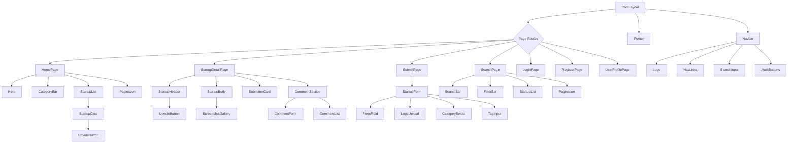

# Component Tree

React applications are built from components — small, self-contained pieces of UI that can be composed together like building blocks. Before writing any code, mapping out your component tree gives you a blueprint for the entire frontend. It answers critical questions: What components do we need? Which component is responsible for which data? Where does state live? In this lesson, you will design the complete component hierarchy for LaunchPad, understand how data flows through it, and learn when to use server components versus client components in Next.js.

## What You'll Learn

- How component-based architecture works and why it matters for large applications
- How to design a component tree from a set of pages and features
- The difference between props and state, and how to decide which component owns each piece of data
- Server components vs client components in Next.js and when to use each
- Data flow patterns including lifting state up and avoiding prop drilling

## Concepts

### Component-Based Architecture

Before component-based frameworks like React, web applications were often built as monolithic HTML pages with JavaScript sprinkled on top. If you wanted to reuse a piece of UI — say, a card that displays a startup — you would copy-paste the HTML and hope you remembered to update every copy when something changed.

Components solve this by encapsulating UI, logic, and styling into reusable units. A `StartupCard` component renders a startup's name, tagline, and upvote count. You use it once in the code, but it appears dozens of times on the page, each instance displaying different data.

The key principles of component architecture:

Single Responsibility — Each component does one thing well. A `StartupCard` displays a startup. An `UpvoteButton` handles upvoting. A `SearchBar` handles search input. When components try to do too many things, they become hard to understand, test, and reuse.

Composition Over Inheritance — You build complex UIs by combining simple components. A `StartupList` is composed of many `StartupCard` components. A `StartupCard` is composed of an image, some text, and an `UpvoteButton`. This composition creates a tree structure — the component tree.

Unidirectional Data Flow — Data flows down the tree through props (from parent to child). When a child needs to communicate with its parent, it calls a function that was passed down as a prop. This one-way flow makes the application predictable and easier to debug.

### Thinking About Components

When you look at a page design, how do you decide where to draw the component boundaries? Use these guidelines:

Can you describe it in one sentence? If a piece of UI has a clear, single purpose — "displays a startup's information in a card format" — it is probably a good component.

Would you reuse it? If the same UI pattern appears in multiple places, extract it into a component.

Does it manage its own state? If a piece of UI has interactive behavior (expanding, toggling, form input), it likely deserves to be its own component.

Is it getting too complex? If a component's code is getting long and hard to follow, break it into smaller sub-components.

### Props vs State

Understanding the difference between props and state is fundamental to React development:

Props are data passed from a parent component to a child component. They are read-only from the child's perspective. Think of them as function arguments — the parent calls the child component and passes in the data it needs.

State is data that a component owns and manages internally. When state changes, the component re-renders. The key question is: which component should own a given piece of state?

The rule of thumb: state should live in the lowest common ancestor of all components that need it. If both `StartupCard` and `StartupHeader` need the upvote count, and they are both children of `StartupDetailPage`, then `StartupDetailPage` should own that state and pass it down as props.

## Step by Step

### Step 1: Identify the Pages

From our earlier lessons, LaunchPad has these pages:

- Home Page — Hero section and list of featured/recent startups
- Startup Detail Page — Full details of a single startup with comments
- Submit Page — Form to submit a new startup
- Search/Browse Page — Search and filter startups by category
- Login Page — Authentication form for existing users
- Register Page — Account creation form
- User Profile Page — A user's submitted startups and activity

Each page is a route in Next.js, and each one becomes a top-level component.

### Step 2: Design the Shared Layout

Every page shares common UI elements. In Next.js App Router, this is handled by the layout component.

```
RootLayout
├── Navbar
│   ├── Logo
│   ├── NavLinks
│   ├── SearchInput
│   └── AuthButtons (Login/Register or UserMenu)
├── {children}  ← page content goes here
└── Footer
    ├── FooterLinks
    └── Copyright
```

The `Navbar` appears on every page and contains the logo, navigation links, a search input for quick searches, and authentication-related buttons. When the user is logged out, it shows Login and Register buttons. When logged in, it shows a user avatar that opens a dropdown menu.

The `Footer` is simpler — just links to About, Terms, Privacy, and a copyright notice.

### Step 3: Home Page Component Tree

The home page is the first thing users see. It has a hero section to explain what LaunchPad is, and a list of startups.

```
HomePage
├── Hero
│   ├── HeroHeading
│   ├── HeroSubtext
│   └── HeroSearchBar
├── CategoryBar
│   └── CategoryPill (×N)
├── StartupList
│   └── StartupCard (×N)
│       ├── StartupLogo
│       ├── StartupInfo
│       │   ├── StartupName
│       │   └── StartupTagline
│       ├── CategoryBadge
│       └── UpvoteButton
└── Pagination
    ├── PrevButton
    ├── PageNumbers
    └── NextButton
```

Data ownership on this page:

The `HomePage` component fetches the list of startups from `GET /api/startups`. Since this is a Next.js server component, it can fetch data directly during rendering without useEffect or useState.

The `CategoryBar` receives the list of categories and the currently selected category as props. When a user clicks a category pill, it updates the URL search params (e.g., `?category=developer-tools`), which triggers a new server-side fetch.

Each `StartupCard` receives a single startup object as a prop. It does not own any state — it simply renders the data it receives.

The `UpvoteButton` is the one interactive element on this page. It needs to be a client component because it handles click events and needs to make a POST request to toggle the upvote. It receives the current `upvoteCount`, `hasUpvoted` status, and `startupId` as props. It manages optimistic state internally — when clicked, it immediately updates the count and visual state before the API call completes.

### Step 4: Startup Detail Page Component Tree

This is the most complex page in the application:

```
StartupDetailPage
├── StartupHeader
│   ├── StartupLogo (large)
│   ├── StartupTitle
│   ├── StartupTagline
│   ├── StartupMeta (launch date, category)
│   └── ActionBar
│       ├── UpvoteButton
│       ├── ShareButton
│       └── EditButton (if owner)
├── StartupBody
│   ├── Description
│   ├── ScreenshotGallery
│   │   └── ScreenshotImage (×N)
│   ├── TagList
│   │   └── Tag (×N)
│   └── ExternalLink
├── SubmitterCard
│   ├── UserAvatar
│   ├── UserName
│   └── UserBio
└── CommentSection
    ├── CommentForm
    │   ├── TextArea
    │   └── SubmitButton
    ├── CommentCount
    └── CommentList
        └── Comment (×N)
            ├── CommentAuthor
            ├── CommentBody
            ├── CommentTimestamp
            └── ReplyButton
```

Data ownership on this page:

The `StartupDetailPage` fetches the startup data from `GET /api/startups/:id`. As a server component, it receives the startup object and passes pieces of it down to child components.

The `UpvoteButton` works the same as on the home page — a client component managing optimistic upvote state.

The `ShareButton` is a client component that uses the browser's share API or copies the URL to clipboard.

The `EditButton` is conditionally rendered — it only appears if the currently authenticated user is the startup's submitter.

The `CommentSection` is where things get interesting. It needs to be a client component because it handles real-time interactions: submitting new comments, displaying the comment form, and potentially loading more comments. The `CommentSection` owns the list of comments in its state. When a user submits a comment through the `CommentForm`, the new comment is added to the state optimistically and then confirmed by the API response.

### Step 5: Submit Page Component Tree

```
SubmitPage
└── StartupForm
    ├── FormField (name)
    │   ├── Label
    │   ├── TextInput
    │   └── ErrorMessage
    ├── FormField (tagline)
    │   ├── Label
    │   ├── TextInput
    │   └── ErrorMessage
    ├── FormField (description)
    │   ├── Label
    │   ├── TextArea
    │   ├── CharacterCount
    │   └── ErrorMessage
    ├── FormField (url)
    │   ├── Label
    │   ├── UrlInput
    │   └── ErrorMessage
    ├── LogoUpload
    │   ├── DropZone
    │   └── Preview
    ├── ScreenshotUpload
    │   ├── DropZone
    │   └── PreviewList
    ├── CategorySelect
    │   ├── Label
    │   └── Dropdown
    ├── TagInput
    │   ├── Label
    │   ├── TextInput
    │   └── TagList
    │       └── Tag (×N, removable)
    ├── DatePicker (launch date)
    └── SubmitButton
```

Data ownership on this page:

The `StartupForm` is a client component that owns all the form state. Each field's value, validation errors, and submission status are managed here. You could use a form library like React Hook Form, or manage the state manually with `useState`.

The `FormField` component is a reusable wrapper that takes a label, an input element, and an optional error message. It does not own any state — everything comes from the parent `StartupForm`.

The `CategorySelect` receives the list of categories as a prop (fetched from `GET /api/categories` by the `SubmitPage` server component).

The `LogoUpload` and `ScreenshotUpload` components handle file selection and upload. They manage their own internal state for the drag-and-drop UI, but report the uploaded file URLs back to the parent form through callback props.

### Step 6: Auth Pages Component Tree

```
LoginPage                          RegisterPage
└── LoginForm                      └── RegisterForm
    ├── FormField (email)              ├── FormField (name)
    │   ├── Label                      │   ├── Label
    │   ├── EmailInput                 │   ├── TextInput
    │   └── ErrorMessage               │   └── ErrorMessage
    ├── FormField (password)           ├── FormField (email)
    │   ├── Label                      │   ├── Label
    │   ├── PasswordInput              │   ├── EmailInput
    │   └── ErrorMessage               │   └── ErrorMessage
    ├── SubmitButton                   ├── FormField (password)
    └── LinkToRegister                 │   ├── Label
                                       │   ├── PasswordInput
                                       │   ├── PasswordStrength
                                       │   └── ErrorMessage
                                       ├── SubmitButton
                                       └── LinkToLogin
```

Both forms are client components because they handle user input and form submission. They share the same `FormField` component used by the submit page.

The `PasswordStrength` component on the register form provides real-time feedback as the user types their password. It checks length, character variety, and common patterns. This is a client component that receives the password value as a prop and manages its own strength calculation.

### Step 7: Search Page Component Tree

```
SearchPage
├── SearchBar
│   ├── SearchIcon
│   ├── SearchInput
│   └── ClearButton
├── FilterBar
│   ├── CategoryFilter
│   │   └── CategoryPill (×N)
│   └── SortSelect
├── ResultsCount
├── StartupList
│   └── StartupCard (×N)
│       └── (same structure as home page)
└── Pagination
```

The `SearchPage` is primarily a server component. Search queries and filters are stored in URL search parameters (`?search=AI&category=developer-tools&sort=popular&page=2`). This means every search, filter change, and page navigation is a new URL, which triggers a server-side fetch.

The `SearchBar` is a client component because it needs to handle typing and debounce the input before updating the URL. When the user stops typing for 300 milliseconds, the component updates the search params in the URL, triggering a new server render.

The `FilterBar` can work as either a server or client component. If each category pill is a simple link that changes the URL, it can be a server component. If you want animated transitions or multi-select, make it a client component.

### Step 8: The Complete Component Tree Diagram

Here is the full component hierarchy for LaunchPad, showing how all the pages and shared components connect:



### Step 9: Server Components vs Client Components

Next.js App Router introduces a powerful distinction between server components and client components. Understanding when to use each is crucial for performance.

Server Components (the default in Next.js App Router):
- Render on the server and send HTML to the browser
- Can directly access databases, file systems, and server-only APIs
- Cannot use useState, useEffect, or event handlers
- Cannot use browser APIs (window, document, localStorage)
- Reduce the JavaScript bundle sent to the browser

Client Components (marked with `"use client"` at the top of the file):
- Render on both the server (for initial HTML) and the client (for interactivity)
- Can use React hooks (useState, useEffect, useRef)
- Can handle user events (onClick, onChange, onSubmit)
- Can access browser APIs
- Add to the JavaScript bundle

Here is how our components break down:

Server Components:
- RootLayout, HomePage, StartupDetailPage, SearchPage, UserProfilePage
- Navbar (the wrapper — individual interactive parts are client components)
- Footer, Hero, StartupBody, SubmitterCard
- StartupList, StartupCard (the card itself is just display)
- CategoryBar (if using simple links)
- Pagination (if using simple links)
- ResultsCount

Client Components:
- UpvoteButton (handles click events, manages optimistic state)
- SearchBar, SearchInput (handles typing, debounce)
- CommentSection, CommentForm (handles form submission, manages comment list)
- StartupForm, LoginForm, RegisterForm (handle form input and submission)
- AuthButtons / UserMenu (handles dropdown toggle, logout action)
- LogoUpload, ScreenshotUpload (handles drag-and-drop, file selection)
- TagInput (handles adding/removing tags)
- ShareButton (uses browser share API)
- PasswordStrength (reacts to input changes)

The general pattern: pages and layout components are server components. Interactive widgets within those pages are client components. This gives you the best of both worlds — fast initial loads with server-rendered HTML, plus rich interactivity where needed.

### Step 10: Data Flow Patterns

Let us trace how data flows through a specific scenario: the home page loading and a user upvoting a startup.

1. The user navigates to the home page. Next.js calls the `HomePage` server component.

2. `HomePage` fetches startups from the API: `GET /api/startups?sort=popular&limit=20`. It also fetches categories from `GET /api/categories`.

3. `HomePage` passes the startup array to `StartupList` as a prop. It passes the categories array to `CategoryBar` as a prop.

4. `StartupList` maps over the array and renders a `StartupCard` for each startup, passing the individual startup object as a prop to each card.

5. Each `StartupCard` renders the startup's name, tagline, logo, and category badge. It also renders an `UpvoteButton`, passing `startupId`, `upvoteCount`, and `hasUpvoted` as props.

6. The user clicks the `UpvoteButton` on a startup. Because `UpvoteButton` is a client component, it can handle the click event.

7. `UpvoteButton` optimistically updates its internal state: it toggles `hasUpvoted` to `true` and increments the count by 1. The UI updates immediately.

8. `UpvoteButton` sends `POST /api/startups/:id/upvote` to the API. If the request succeeds, the optimistic state is confirmed. If it fails, the component reverts to the previous state and shows an error.

This pattern — server components for data fetching, client components for interactivity, optimistic updates for responsiveness — is the foundation of a modern Next.js application.

Lifting State Up:

Sometimes you need to share state between sibling components. For example, on the search page, the `SearchBar` and `FilterBar` both affect which startups are displayed in `StartupList`. Instead of each component making its own API call, you lift the search parameters up to the `SearchPage` level.

In Next.js App Router, the URL search parameters serve as the "lifted state." When the `SearchBar` updates the `?search=` parameter and the `FilterBar` updates the `?category=` parameter, the `SearchPage` server component re-renders with both parameters and fetches the filtered results.

Avoiding Prop Drilling:

Prop drilling happens when you pass data through multiple layers of components that do not use it, just to get it to a deeply nested component. For example, passing the current user's ID from `RootLayout` through `HomePage` through `StartupList` through `StartupCard` to `UpvoteButton`.

Solutions to prop drilling:
- React Context — Create a context provider that wraps the component tree and makes data available to any descendant component. This works well for global data like the current user or theme.
- URL Search Parameters — For page-level state like search queries and filters.
- Server Component Data Fetching — In Next.js, deeply nested server components can fetch their own data directly, eliminating the need to pass it down from parents.

For LaunchPad, we will use a context provider for the authenticated user (so `UpvoteButton`, `CommentForm`, and `AuthButtons` can all access the user without prop drilling) and URL parameters for search and filter state.

## Try It Yourself

Design the component tree for a User Profile Page. This page shows:

- The user's avatar, name, bio, and join date
- Statistics: number of startups submitted, total upvotes received
- A tab interface with two tabs:
  - "Submissions" — A list of startups the user has submitted
  - "Upvotes" — A list of startups the user has upvoted
- An "Edit Profile" button (only visible if viewing your own profile)
- Clicking "Edit Profile" opens an inline form to edit name, bio, and avatar

Think through:

1. What components do you need? Draw the tree.
2. Which components are server components and which are client components?
3. Where does the tab selection state live?
4. Where does the edit mode state live?
5. What data does each component receive as props?
6. Which API endpoints from Lesson 05 does this page call?

Here is a starting point:

```
UserProfilePage
├── ProfileHeader
│   ├── UserAvatar
│   ├── UserInfo (name, bio, join date)
│   ├── UserStats
│   └── EditProfileButton
├── ProfileTabs
│   ├── TabButton ("Submissions")
│   └── TabButton ("Upvotes")
└── TabContent
    └── StartupList
        └── StartupCard (×N)
```

Expand this tree and annotate each component with (S) for server or (C) for client. Identify which component owns the tab state and the edit mode state.

## Key Takeaways

- Component-based architecture breaks the UI into small, reusable, single-responsibility pieces that compose together into a tree structure.
- Start by identifying your pages, then break each page into logical sections, then break sections into individual components.
- Props flow down the tree (parent to child). State lives in the component that owns the data, and is the lowest common ancestor of all components that need it.
- Server components are the default in Next.js App Router — use them for pages, layouts, and any component that just displays data.
- Client components are needed for interactivity — event handlers, hooks, browser APIs. Mark them with `"use client"`.
- Minimize client components to keep your JavaScript bundle small. Only the interactive parts need to be client components.
- Use React Context for truly global data (authenticated user, theme). Use URL search parameters for page-level state (search, filters, pagination). Use local state for component-specific interactivity (form inputs, toggles).
- Optimistic updates in client components make the UI feel fast by updating state before the server confirms the action.

## Next Steps

We have now designed both the API contracts (how data moves between frontend and backend) and the component tree (how the frontend is structured). In the next lesson, we will document the architecture decisions behind these designs — why we chose Next.js, why Express for the API, why SQLite to start with. These Architecture Decision Records will serve as a historical reference for the reasoning behind every major technical choice.
