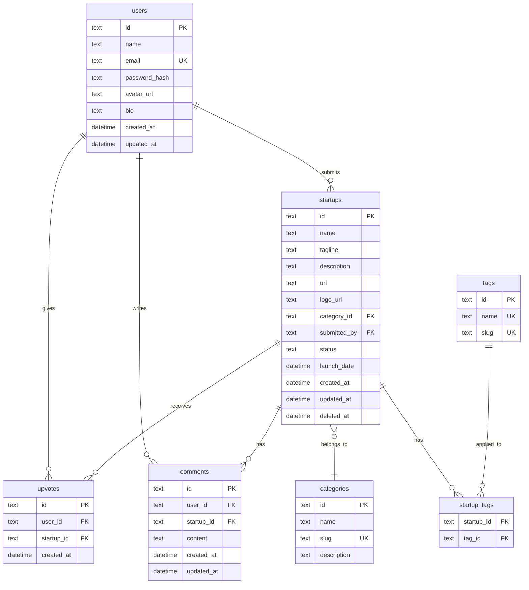

# Technical Spec

You have spent seven lessons thinking through every dimension of LaunchPad — what it does, who it serves, what features to build first, how the data is structured, how the API works, how the frontend is organized, and why you made each technical choice. Now it is time to bring it all together into a single document: the technical specification. A tech spec is the bridge between planning and building. It is the document that says "here is exactly what we are building and how." In this lesson, you will create a complete technical specification for LaunchPad and learn how to maintain it as a living document.

## What You'll Learn

- What a technical specification is, who reads it, and when to write one
- How to structure a tech spec that is thorough without being overwhelming
- How to synthesize planning work from multiple dimensions into a cohesive document
- How to write non-functional requirements (performance, security, scalability)
- How to create a development timeline with realistic milestones
- How to identify and assess technical risks

## Concepts

### What Is a Technical Specification?

A technical specification (or "tech spec") is a document that describes what a software system will do and how it will be built. It sits between the product requirements ("what users want") and the actual code ("how the computer does it"). A good tech spec answers the question: if someone handed this document to a competent engineering team that knew nothing about the project, could they build it?

Tech specs vary in formality. At a startup with three engineers, a tech spec might be a two-page document in Notion. At a large company, it might be a twenty-page document that goes through a formal review process. The format matters less than the content — what matters is that the key decisions are written down and agreed upon.

### Who Reads a Technical Spec?

Different readers look for different things:

Engineers read the entire spec to understand what they need to build. They focus on the data model, API contracts, and architecture decisions. They want enough detail to start coding without ambiguity.

Engineering managers read the spec to understand scope and timeline. They want to know how long the project will take, what the milestones are, and what risks might cause delays.

Product managers read the overview, requirements, and scope sections. They want to confirm that the technical approach delivers the user experience they envisioned.

Future team members read the spec months or years later to understand why the system was built the way it was. The architecture decisions and trade-off discussions are especially valuable for them.

Your future self reads the spec when you return to the project after a break. The context you carefully documented will save you hours of re-discovery.

### When to Write a Tech Spec

Write a tech spec when:

- A project will take more than a few days to build
- Multiple people will work on it (even if "multiple people" means you and your future self)
- The system has moving parts that need to coordinate (frontend, backend, database)
- There are non-obvious technical decisions that deserve documentation
- Stakeholders need to review and approve the approach before work begins

Do not write a spec for trivial changes, bug fixes, or small features that can be described in a single ticket. The overhead of a spec should be proportional to the project's complexity and risk.

## Step by Step

### Step 1: Project Overview

This section gives the reader a quick understanding of what LaunchPad is, why we are building it, and who it serves. Someone should be able to read just this section and understand the project at a high level.

---

LaunchPad Technical Specification, Version 1.0

Project: LaunchPad — A Startup Directory Platform

LaunchPad is a web application where founders can showcase their startups and the tech community can discover, upvote, and discuss new products. Think of it as a community-curated directory where the best startups rise to the top through upvotes, similar to how Product Hunt operates.

The platform serves three types of users:

Startup founders who want to launch their products and get visibility. They submit their startup with a name, description, URL, screenshots, and category. A successful launch brings traffic, users, and feedback.

Tech enthusiasts who want to discover new products. They browse the directory, search by category or keyword, upvote startups they find interesting, and leave comments with feedback or questions.

Casual visitors who arrive from search engines or social media links. They view individual startup pages, read descriptions and comments, and may sign up if they want to participate.

The core value proposition is simple: founders get a stage, and the community gets a curated feed of new products.

### Step 2: Requirements Summary

This section summarizes the user stories and requirements from Lesson 02, organized by user role.

---

Functional Requirements:

As a visitor (unauthenticated user):
- I can browse the home page and see a list of startups sorted by popularity or recency.
- I can search for startups by name or keyword.
- I can filter startups by category.
- I can view a startup's detail page with its full description, screenshots, and comments.
- I can view user profiles showing their submitted startups.
- I can create an account by providing a name, email, and password.
- I can log in with my email and password.

As a registered user:
- I can upvote startups I find interesting (one upvote per startup, toggleable).
- I can submit a new startup with all required details.
- I can edit startups that I submitted.
- I can delete startups that I submitted.
- I can post comments on startup detail pages.
- I can edit and delete my own comments.
- I can view and edit my profile (name, bio, avatar).
- I can see a list of startups I have upvoted on my profile page.

As an administrator:
- I can edit or remove any startup (for moderation purposes).
- I can view all startups including unpublished ones.

### Step 3: Feature Scope and MVP

This section defines the boundary between what we build in the first release and what comes later. It references the feature breakdown from Lesson 03.

---

MVP (Version 1.0) — The features we will build in this course:

Core features:
- User authentication (register, login, logout)
- Startup submission with name, tagline, description, URL, logo, category, and tags
- Startup listing with pagination (20 per page)
- Startup detail page with full information and screenshots
- Category browsing with filter
- Keyword search
- Upvoting (toggle upvote, display count)
- User profiles showing submitted startups

Included in MVP but simplified:
- Comments (flat list, no threading in V1)
- Sorting (newest and most popular only)
- Image handling (URL-based, no upload in V1)

Explicitly excluded from MVP:
- Social login (Google, GitHub) — added in a future iteration
- Email notifications (upvote alerts, comment notifications)
- Startup analytics (view count, traffic sources)
- Admin dashboard (moderation will use direct database access in V1)
- Collections/bookmarks (saving startups to personal lists)
- Maker profiles (linking team members to a startup)
- Weekly/monthly digest emails
- API rate limiting (not needed at MVP scale)

The scoping principle: if a feature is not required for the core loop of "submit a startup, discover startups, upvote startups," it is deferred to a future version.

### Step 4: Data Model

This section presents the database schema from Lesson 04. We include the entity-relationship diagram and table definitions.

---

The LaunchPad database consists of six tables:



Key design decisions in the data model:

Soft deletes for startups — The `deleted_at` column allows recovery and maintains referential integrity. A startup with comments and upvotes should not be hard-deleted.

Unique constraint on upvotes — The combination of `user_id` and `startup_id` in the upvotes table is unique, enforcing the "one upvote per user per startup" business rule at the database level.

Tags as a many-to-many relationship — The `startup_tags` junction table allows startups to have multiple tags and tags to be shared across startups.

Slug columns on categories and tags — These provide URL-friendly identifiers (e.g., "developer-tools" instead of "c_devtools") for use in routes and query parameters.

### Step 5: API Contracts Summary

This section provides a reference table of all API endpoints from Lesson 05, with links to the detailed contract for each one.

---

The LaunchPad API follows REST conventions with a consistent response envelope. All responses are wrapped in a `data` field (for success) or an `error` field (for failures).

Authentication uses Bearer tokens in the Authorization header. Tokens are obtained from the login or register endpoints.

Endpoint Reference:

| Method | Endpoint | Auth | Description | Success Code |
|--------|----------|------|-------------|--------------|
| GET | /api/startups | No | List startups with pagination, search, and filter | 200 |
| GET | /api/startups/:id | No | Get full startup details | 200 |
| POST | /api/startups | Yes | Create a new startup | 201 |
| PUT | /api/startups/:id | Owner | Update a startup | 200 |
| DELETE | /api/startups/:id | Owner | Soft-delete a startup | 200 |
| POST | /api/startups/:id/upvote | Yes | Toggle upvote | 200 |
| GET | /api/startups/:id/comments | No | List comments on a startup | 200 |
| POST | /api/startups/:id/comments | Yes | Add a comment | 201 |
| GET | /api/categories | No | List all categories | 200 |
| POST | /api/auth/register | No | Create account | 201 |
| POST | /api/auth/login | No | Authenticate | 200 |
| GET | /api/users/:id | No | Get user profile | 200 |

Pagination: All list endpoints use offset-based pagination with `page` and `limit` query parameters. The default page size is 20, with a maximum of 100.

Error format: All errors return an `error` object with `code` (machine-readable string), `message` (human-readable explanation), and optional `details` (array of field-level validation errors).

### Step 6: Frontend Architecture

This section summarizes the component tree and data flow patterns from Lesson 06.

---

The frontend is a Next.js 15 application using the App Router. It uses a mix of server components (for data fetching and static content) and client components (for interactivity).

Route Structure:

```
/                          → HomePage
/startups/[id]             → StartupDetailPage
/startups/new              → SubmitPage
/search                    → SearchPage
/login                     → LoginPage
/register                  → RegisterPage
/users/[id]                → UserProfilePage
```

Component Strategy:

Server components handle data fetching, layout, and content display. Every page-level component is a server component. Components like `StartupCard`, `StartupBody`, and `SubmitterCard` are server components because they only display data without user interaction.

Client components handle interactivity. `UpvoteButton` manages optimistic upvote state. `SearchBar` handles debounced input. `CommentSection` manages the comment list and form. All form components (`StartupForm`, `LoginForm`, `RegisterForm`) are client components.

State Management:

- Authentication state: React Context via an `AuthProvider` wrapping the application. Provides the current user object and login/logout functions to any component.
- Search and filter state: URL search parameters. Changes to search, category, or sort update the URL, triggering a server-side re-render.
- Form state: Local component state managed with `useState` or a form library.
- Upvote state: Local optimistic state within the `UpvoteButton` client component.
- Comment state: Local state within the `CommentSection` client component.

### Step 7: Architecture Decisions Summary

This section references the ADRs from Lesson 07.

---

| ADR | Decision | Rationale |
|-----|----------|-----------|
| ADR-001 | Next.js 15 for frontend | Largest React ecosystem, server components, built-in SSR for SEO |
| ADR-002 | Express.js for API | Ubiquitous, extensive documentation, largest middleware ecosystem |
| ADR-003 | SQLite (dev) to PostgreSQL (prod) | Zero setup friction for development, ORM enables smooth migration |
| ADR-004 | TypeScript everywhere | Compile-time type safety, shared API contract types, IDE productivity |
| ADR-005 | Separate repos per course | Focused learning context, self-contained modules |

All decisions are documented with full context, alternatives considered, and consequences in the project's ADR directory.

### Step 8: Non-Functional Requirements

Non-functional requirements describe how the system should behave, as opposed to what it should do. These are qualities that users experience but rarely articulate — they expect the page to load fast, their data to be secure, and the site to work on their phone.

---

Performance Requirements:

- Page load time: The home page and startup detail page should achieve a Largest Contentful Paint (LCP) under 2.5 seconds on a standard broadband connection. Server-side rendering in Next.js helps achieve this.
- API response time: All API endpoints should respond within 200 milliseconds for standard queries. List endpoints with search and filter should respond within 500 milliseconds.
- Time to interactive: The page should be interactive (buttons clickable, forms usable) within 3.5 seconds of initial load.
- Database queries: No single database query should take more than 100 milliseconds. Queries on the startups table should use indexes on `category_id`, `status`, `created_at`, and `submitted_by`.

Security Requirements:

- Passwords are hashed using bcrypt with a cost factor of 10 before storage. Plain-text passwords are never stored or logged.
- Authentication tokens (JWT) expire after 7 days. Tokens are stored in HTTP-only cookies to prevent XSS access.
- All user input is validated on the server side, even if client-side validation is also present. Never trust the client.
- SQL injection is prevented by using parameterized queries through the ORM. Raw SQL strings with user input are prohibited.
- Cross-Site Request Forgery (CSRF) protection is implemented for all state-changing endpoints.
- Rate limiting on authentication endpoints prevents brute-force attacks: maximum 5 login attempts per minute per IP address.
- CORS is configured to allow requests only from the frontend's domain.

Scalability Considerations:

For the MVP, LaunchPad is expected to handle dozens of concurrent users, not thousands. However, certain design choices position the application for growth:

- The PostgreSQL migration path (ADR-003) enables connection pooling and read replicas if traffic increases.
- The stateless API design (using JWT tokens rather than server-side sessions) means API servers can be horizontally scaled behind a load balancer.
- Static assets (images, screenshots) should be served from a CDN, not from the application server.
- The database schema includes indexes on columns used in WHERE and ORDER BY clauses.

Accessibility Requirements:

- All interactive elements (buttons, links, form inputs) must be keyboard-accessible.
- Form fields must have associated labels.
- Color contrast ratios must meet WCAG 2.1 AA standards (4.5:1 for normal text, 3:1 for large text).
- Images must have descriptive alt text.
- The application must be usable with a screen reader.

Reliability:

- The application should have 99% uptime during the course and demonstration period.
- Database backups should run daily for the production PostgreSQL instance.
- Error logging should capture unhandled exceptions with enough context to diagnose issues (request URL, user ID, stack trace).

### Step 9: Development Timeline and Milestones

A timeline turns a specification into a plan. Milestones are checkpoints where you can verify progress and course-correct. For LaunchPad, we organize the timeline around the course modules.

---

The development timeline follows the course structure. Each phase has a clear deliverable that can be demonstrated independently.

Phase 1: Foundation (Weeks 1-2)

Milestone: Project setup and core data layer

- Set up the Express API project with TypeScript configuration
- Configure Drizzle ORM with SQLite
- Define database schema and run migrations
- Implement seed data script (categories, sample startups, test users)
- Deliverable: Running API that serves seed data from the database

Phase 2: Core API (Weeks 3-4)

Milestone: All CRUD endpoints operational

- Implement authentication endpoints (register, login)
- Implement startup CRUD endpoints (list, detail, create, update, delete)
- Implement upvote toggle endpoint
- Implement category listing endpoint
- Add request validation with Zod
- Add error handling middleware
- Deliverable: Complete API that passes integration tests for all endpoints

Phase 3: Frontend Shell (Weeks 5-6)

Milestone: All pages rendering with real data

- Set up Next.js 15 project with TypeScript
- Implement shared layout (Navbar, Footer)
- Build the home page with startup list and pagination
- Build the startup detail page
- Build the search page with filters
- Connect all pages to the API
- Deliverable: Browsable frontend that displays real startup data

Phase 4: Interactivity (Weeks 7-8)

Milestone: Full user interaction flow

- Implement authentication UI (login, register forms)
- Build the startup submission form
- Add upvote functionality with optimistic updates
- Build the comment section
- Implement user profile page
- Add loading states and error handling throughout
- Deliverable: Complete application where users can register, submit startups, upvote, and comment

Phase 5: Polish and Deploy (Weeks 9-10)

Milestone: Production-ready application

- Migrate from SQLite to PostgreSQL
- Add input validation and error messages across all forms
- Implement responsive design for mobile devices
- Add SEO metadata (Open Graph tags, page titles)
- Set up deployment (Vercel for frontend, Railway or Render for API)
- Final testing and bug fixes
- Deliverable: Deployed application accessible via a public URL

Each phase builds on the previous one. The deliverable at the end of each phase is a working application — not complete, but functional at its current scope. This incremental approach means you always have something to show and test.

### Step 10: Risk Assessment

Every project has risks — technical challenges, dependencies, and unknowns that could cause delays or failures. Identifying risks early allows you to plan mitigations rather than react to surprises.

---

Risk 1: SQLite-to-PostgreSQL Migration Complications

Likelihood: Medium
Impact: High

Description: While Drizzle ORM abstracts most database differences, there may be queries or behaviors that work in SQLite but fail in PostgreSQL. Date handling, string comparisons, and auto-increment behavior differ between the two databases.

Mitigation: Write all queries using Drizzle's query builder rather than raw SQL. Run the test suite against both SQLite and PostgreSQL in CI. Perform the migration early in Phase 5 to allow time for fixing compatibility issues. Maintain a list of known SQLite-PostgreSQL differences relevant to our schema.

Risk 2: Next.js Server Component Learning Curve

Likelihood: High
Impact: Medium

Description: The server component model in Next.js App Router is significantly different from traditional React development. Learners may struggle with the distinction between server and client components, especially around data fetching patterns, serialization boundaries, and "use client" placement.

Mitigation: Lesson 06 explicitly maps each component as server or client. Provide clear guidelines for when to use each. Start Phase 3 with simple server-rendered pages before adding client interactivity in Phase 4. Include debugging tips for common server component errors (attempting to use hooks in server components, passing non-serializable props across the boundary).

Risk 3: Authentication Token Management

Likelihood: Medium
Impact: High

Description: JWT-based authentication has several subtleties — token storage (localStorage vs cookies), token refresh, handling expired tokens, and protecting against XSS and CSRF. Incorrect implementation could lead to security vulnerabilities or broken user sessions.

Mitigation: Use HTTP-only cookies for token storage rather than localStorage (prevents XSS access to tokens). Implement a clear token refresh flow. Use a well-tested JWT library rather than rolling custom token logic. Include CSRF protection on all state-changing endpoints. Test authentication flows thoroughly, including edge cases like expired tokens and concurrent requests.

Risk 4: Scope Creep During Development

Likelihood: High
Impact: Medium

Description: As the application takes shape, it is tempting to add features that were explicitly excluded from the MVP — social login, notifications, analytics, admin dashboard. Each addition delays the core deliverable and increases complexity.

Mitigation: The feature scope section of this spec clearly defines what is in and out of the MVP. When a new idea arises during development, add it to a "Future Features" list rather than implementing it immediately. Evaluate new features only after the MVP is complete and deployed.

Risk 5: Third-Party Library Breaking Changes

Likelihood: Low
Impact: Medium

Description: Next.js, Drizzle, and other dependencies release new versions during the course timeline. A breaking change in a dependency could require code modifications.

Mitigation: Pin dependency versions in package.json (use exact versions, not ranges). Only upgrade dependencies intentionally, not automatically. If an upgrade is needed, do it at a milestone boundary when the application is in a stable state.

### Step 11: Maintaining a Living Spec

A technical specification is not a document you write once and forget. As you build the application, you will discover things that change the plan — a feature takes longer than expected, a technical approach does not work as planned, or a new requirement emerges.

Here is how to keep the spec useful throughout the project:

Update the spec when decisions change. If you wrote ADR-003 choosing SQLite but then migrated to PostgreSQL earlier than planned, update the spec to reflect the current state. Mark the old decision as superseded.

Keep the spec as the source of truth. When someone asks "what does the upvote endpoint return?", the answer should be in the spec. If the spec disagrees with the code, one of them is wrong and should be fixed.

Review the spec at each milestone. At the end of each development phase, compare what was built with what was planned. Update the spec to reflect any deviations. Document why the deviation happened.

Do not over-document. The spec should capture decisions and interfaces, not implementation details. How a function works internally is documented in code comments. What the function does and why it exists is documented in the spec.

Version the spec. If you use git, keep the spec in the repository so its history is tracked alongside the code. If you use a wiki or document editor, use the built-in version history.

### Step 12: Putting It All Together

The LaunchPad technical specification is now complete. Here is a summary of what it contains and where each section came from:

| Spec Section | Source Lesson | Purpose |
|-------------|---------------|---------|
| Project Overview | Lesson 01: What We Are Building | Establishes vision and target users |
| Requirements | Lesson 02: User Stories | Defines what the system must do |
| Feature Scope | Lesson 03: Feature Breakdown | Sets MVP boundaries |
| Data Model | Lesson 04: Data Modeling | Defines database structure |
| API Contracts | Lesson 05: API Contracts | Defines frontend-backend communication |
| Frontend Architecture | Lesson 06: Component Tree | Defines UI structure and data flow |
| Architecture Decisions | Lesson 07: Architecture Decisions | Documents and justifies technical choices |
| Non-Functional Requirements | This lesson | Defines performance, security, and quality |
| Development Timeline | This lesson | Creates a realistic build schedule |
| Risk Assessment | This lesson | Identifies and mitigates potential problems |

Each lesson contributed a specific dimension of the system design. Individually, they answer narrow questions. Together, they form a comprehensive blueprint.

This is the power of thinking in systems — instead of jumping into code and figuring things out as you go, you have spent time understanding the problem from every angle. You know what you are building, who it is for, how the data is structured, how the parts communicate, and what risks to watch for.

When you sit down to write the first line of code in the next course, you will not be starting from scratch. You will be implementing a plan.

## Try It Yourself

Write a risk assessment section covering three technical risks for a different project — a real-time chat application. Consider these aspects of the system:

- WebSocket connections for real-time messaging
- Message storage and retrieval (loading chat history)
- User presence (showing who is online)
- File/image sharing in chat messages
- End-to-end encryption

For each risk, use this format:

```
Risk: [Title]
Likelihood: Low / Medium / High
Impact: Low / Medium / High

Description: [2-3 sentences explaining the risk]

Mitigation: [2-3 sentences explaining how to reduce the risk]
```

Here are some risks to consider (pick three and write them up):

- WebSocket connection reliability on mobile networks
- Message ordering when multiple messages are sent simultaneously
- Scaling WebSocket connections beyond a single server
- Storing and serving large file attachments efficiently
- Key management complexity for end-to-end encryption
- Message history loading performance for active chat rooms

The goal is to practice identifying risks that are specific and actionable (not vague fears like "something might go wrong") and writing mitigations that are concrete steps (not wishful thinking like "hope it works out").

## Key Takeaways

- A technical specification is the bridge between planning and building. It synthesizes product requirements, data design, API contracts, frontend architecture, and architecture decisions into a single document.
- The audience for a tech spec includes engineers (for implementation detail), managers (for scope and timeline), product managers (for requirements alignment), and your future self (for context recovery).
- Non-functional requirements (performance, security, accessibility, reliability) are just as important as functional requirements but are often forgotten until problems arise in production.
- A development timeline with clear milestones turns a spec into an actionable plan. Each milestone should produce a working deliverable, not just a percentage of completed code.
- Risk assessment is about identifying specific, plausible problems and planning concrete mitigations. It is not about predicting the future — it is about being prepared.
- A tech spec is a living document. Update it when decisions change, review it at milestones, and keep it in version control.
- The eight lessons in this course — vision, user stories, feature scope, data model, API contracts, component tree, architecture decisions, and technical spec — form a complete system design methodology that you can apply to any project.

## Next Steps

Congratulations — you have completed the "Think in Systems" course. You now have a comprehensive technical specification for LaunchPad that covers every dimension of the system.

In the next course, you will start building. The backend course will take the data model from Lesson 04 and the API contracts from Lesson 05 and turn them into a working Express API with a real database. You will implement every endpoint we designed, handle authentication, validate requests, and write tests to verify your API matches the contracts.

The spec you wrote in this course is not just an exercise — it is the roadmap for everything that comes next. Keep it open as you build. Reference it when you forget what an endpoint should return. Update it when reality diverges from the plan.

Building software is a craft. Planning is where you sharpen your tools. Now it is time to use them.
